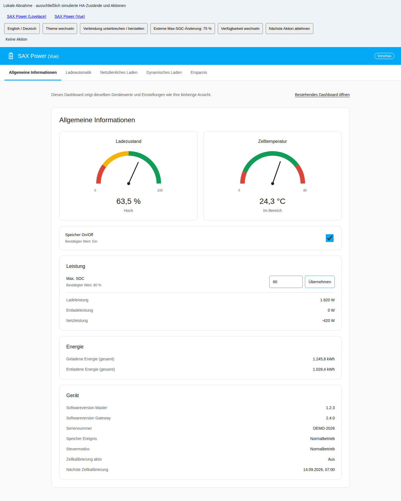
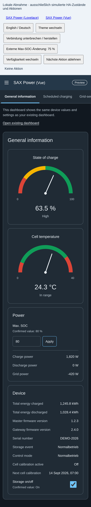
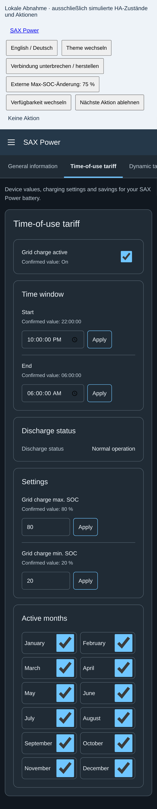
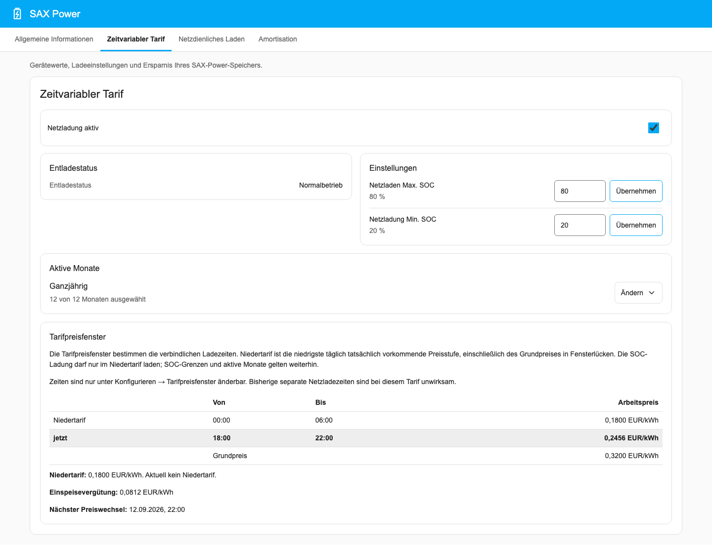
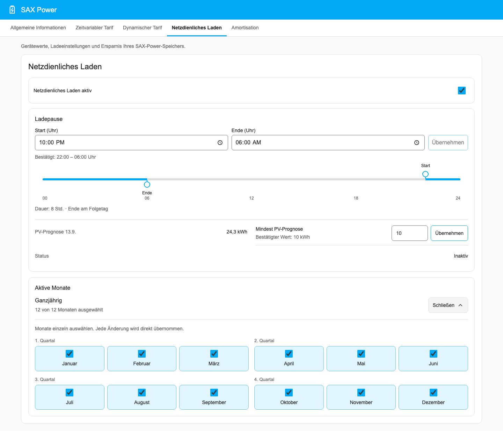
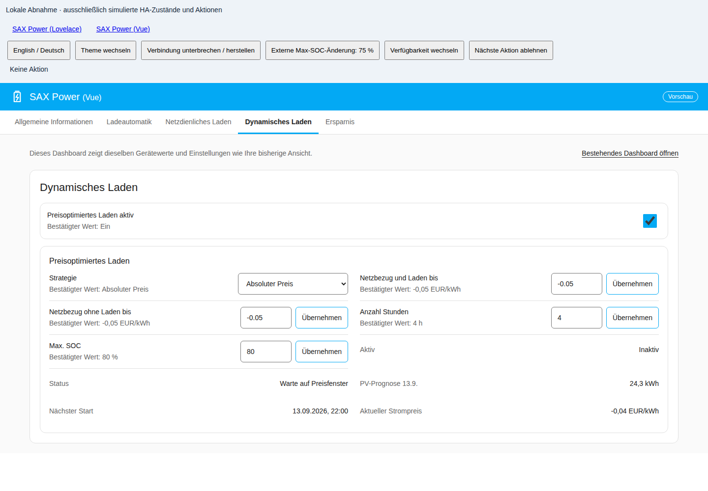
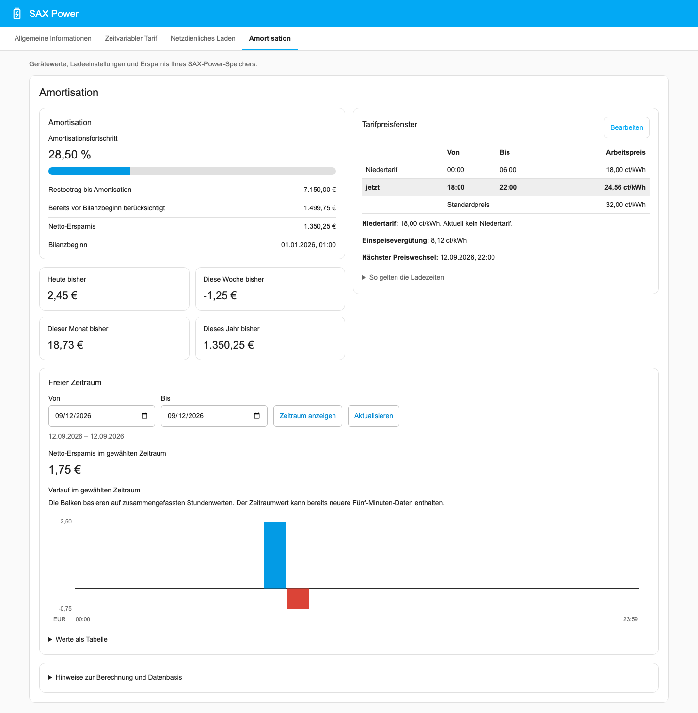

<p align="center">
  
</p>

<h1 align="center">SAX Power Home für Home Assistant</h1>

<p align="center">
  Den Speicher im Blick. Laden, wenn es passt.
</p>

Diese Integration verbindet deinen **SAX Power Home oder Home Plus** über
Modbus TCP mit Home Assistant. Du siehst, was der Speicher gerade macht,
legst Ladezeiten und Ladegrenzen fest und kannst seine Ersparnis verfolgen.
Alles läuft im lokalen Netzwerk, ohne Cloud-Konto und ohne YAML-Konfiguration.



- **Messwerte:** Ladezustand, Leistung, Temperatur und Energiezähler für eigene
  Dashboards und Automationen.
- **Ladesteuerung:** feste Ladezeiten, günstige Börsenpreise oder eine
  Ladepause für die PV-Mittagsspitze.
- **Ladegrenze:** einen maximalen Ladezustand für Netz- und PV-Ladung festlegen.
- **Wirtschaftlichkeit:** Kosten, Netto-Ersparnis und Amortisationsstand mit
  deinem Tarif berechnen.
- **Dashboard:** eine eigene SAX-Power-Ansicht für Computer und Smartphone,
  auf Deutsch und Englisch, im hellen oder dunklen Design.

[Installation](#installation) · [Einrichtung](#einrichtung) ·
[Dashboard](#dashboard) · [Ladefunktionen](#ladefunktionen) ·
[Wirtschaftlichkeit](#tarifmodell-für-die-wirtschaftlichkeit) ·
[Fehlersuche](#diagnose-und-fehlersuche)

## Voraussetzungen

- **Home Assistant ab 2026.8.2**
- **SAX Power Home oder Home Plus** mit aktiviertem Modbus TCP, im selben
  Netzwerk wie Home Assistant
- Für erweiterte Messwerte und Ladefunktionen: kompatible Firmware,
  empfohlen **Master V61 / Gateway V54 oder neuer**

Derzeit wird **ein SAX-Speicher je Home-Assistant-Installation** unterstützt.

## Installation

### Über HACS

1. **HACS → Integrationen → Benutzerdefinierte Repositories** öffnen.
2. `https://github.com/dr-dimitri/sax-ha` eintragen und **Integration** wählen.
3. Nach **SAX Power Home** suchen und installieren.
4. Home Assistant neu starten.

### Manuell

Den Ordner [`custom_components/sax_power`](custom_components/sax_power) in
`custom_components` deiner Home-Assistant-Konfiguration kopieren und
Home Assistant neu starten.

## Einrichtung

Unter **Einstellungen → Geräte & Dienste → Integration hinzufügen** nach
**SAX Power** suchen. Du brauchst die IP-Adresse des Speichers; die übrigen
Verbindungswerte kannst du normalerweise übernehmen:

| Einstellung | Standard |
| --- | --- |
| Port | 502 |
| Slave-ID, Basic Mode | 64 |
| Slave-ID, SunSpec-Modus | 100 |
| Aktualisierungsintervall der grundlegenden Messwerte | 10 Sekunden |

Die Verbindung wird vor dem Speichern geprüft. Im Anschluss kannst du die
zeitgesteuerte Netzladung vorbelegen und das Dashboard aktivieren.

Weitere Optionen findest du unter **Einstellungen → Geräte & Dienste →
SAX Power Home → Konfigurieren**: Strompreis-Sensor, PV-Prognose,
Wirtschaftlichkeit und Dashboard. Ladezeiten, Monate und Ladegrenzen änderst
du direkt im Dashboard oder über die Entitäten des Geräts. Die Einstellungen
bleiben nach einem Neustart erhalten.

### Verbindung nachträglich ändern

Hat der Speicher eine neue IP-Adresse, wähle beim bestehenden
Integrationseintrag **Neu konfigurieren**. Dort lassen sich auch Port,
Slave-IDs und Aktualisierungsintervall ändern. Nach erfolgreicher Prüfung
lädt Home Assistant die Integration neu.

## Dashboard

Mit **Dashboard aktivieren** erscheint **SAX Power** in der Seitenleiste.
Die Option ist anfangs ausgeschaltet und lässt sich jederzeit unter
**Konfigurieren** ändern. Das Dashboard wird mit der Integration ausgeliefert;
eine zusätzliche Installation ist nicht nötig.

Die Screenshots zeigen das Dashboard mit Beispieldaten.

| Bereich | Das findest du dort |
| --- | --- |
| Allgemeine Informationen | Ladezustand, Leistung, Temperatur, Energiezähler und Speicherschalter |
| Zeitvariabler Tarif | Feste Ladezeiten, Monate, Startschwelle, Netzladeziel und Tarifpreisfenster |
| Dynamischer Tarif | Preisstrategie, Preisgrenzen und nächster Ladestart |
| Netzdienliches Laden | PV-Ladepause, Monate und Prognoseschwelle |
| Amortisation | Netto-Ersparnis, Tarifplan und Auswertung eigener Zeiträume |

Schalter und Monatsauswahl zeigen ihren Zustand direkt am Haken. Zahlen
und Uhrzeiten sendest du mit **Übernehmen**. Die Zeitfenster lassen sich
über die 24-Stunden-Leiste verschieben oder als Uhrzeit eingeben; Start und
Ende werden gemeinsam übernommen. Vor dem Ein- oder Ausschalten des
Speichers erscheint eine Bestätigung.

Zeitvariabler und dynamischer Tarif können nicht gleichzeitig aktiv sein.
Das Dashboard zeigt den eingeschalteten Tarif und blendet den anderen aus.
Sind beide ausgeschaltet, stehen beide zur Auswahl.

<details>
<summary>So sieht das Dashboard auf dem Smartphone aus</summary>

<p>
  
  
</p>

</details>

Nach einem Dashboard-Update kann unter **Einstellungen → System →
Reparaturen** ein Hinweis erscheinen. Folge den Schritten und lade danach
die Home-Assistant-Seite im Browser vollständig neu. Das Integrationsupdate
selbst installierst du wie gewohnt über HACS. Bestehende eigene
Lovelace-Dashboards bleiben erhalten.

## Wichtige Entitäten

Die Gerätewerte findest du beim SAX-Power-Gerät. Selten benötigte Detailwerte
findest du dort unter **Diagnose**.

| Entität | Bedeutung |
| --- | --- |
| Ladezustand | Aktuelle Speicherfüllung in Prozent, auch SOC genannt |
| Netzleistung | Positiv: Netzbezug; negativ: Einspeisung |
| Lade-/Entladeleistung | Positiv: Entladung; negativ: Ladung |
| Max. SOC | Globale Ladegrenze für den Speicher |
| Netzladen Max. SOC | Eigenes Ziel der zeitgesteuerten Netzladung, höchstens Max. SOC |
| Netzladung Min. SOC | Startschwelle der zeitgesteuerten Netzladung |
| Speicher On/Off | Speicher ein- oder ausschalten |

Dazu kommen getrennte Lade- und Entladeleistung, PV-Leistung, Zelltemperatur,
Energiezähler sowie Geräte-, Firmware- und Akkustatus. Die PV-Leistung ist
laut Hersteller nur mit dem Smart Meter **ADW200** vollständig verfügbar.
Andere Modelle können hier dauerhaft 0 W melden.

## Max-SOC-Sperre

**Max. SOC** begrenzt den Ladezustand für die Ladefunktionen der Integration
und für PV-Überschuss. Mit 80 % bleibt beispielsweise Platz im Speicher;
bei 100 % greift keine niedrigere Ladegrenze.

Die Sperre pausiert **Laden und Entladen**. Wird die Grenze innerhalb eines
Ladezeitfensters erreicht, bleibt die Pause bis zu dessen Ende aktiv.
Außerhalb solcher Zeitfenster gibt anhaltender Netzbezug den Speicher wieder
für den Hausverbrauch frei.

### Regelmäßige Zellkalibrierung

Bei einer Grenze unter 100 % nutzt die Integration regelmäßig eine volle
Ladung zur Zellkalibrierung: Am dritten Kalendertag nach der letzten
Volladung wird das Ladeziel vorübergehend auf 100 % gesetzt. Die Funktion
wartet auf die nächste reguläre Lademöglichkeit und startet dafür keine
zusätzliche Netzladung. Deine eingestellten Grenzen bleiben erhalten.

Die Diagnose-Entitäten **Zellkalibrierung aktiv** und **Nächste
Zellkalibrierung** zeigen Status und Datum. Eine Volladung am 12. September
bedeutet also: nächste Fälligkeit am 15. September.

## Ladefunktionen

Die zeitgesteuerte und die preisoptimierte Netzladung sind Alternativen.
Beim Umschalten fragt Home Assistant nach, bevor es die bisher aktive
Funktion ausschaltet. Netzdienliches Laden lässt sich zusätzlich nutzen
und hat während seiner wirksamen Ladepause Vorrang vor der Preisoptimierung.

### Zeitgesteuerte Netzladung

Im Dashboard heißt dieser Bereich **Zeitvariabler Tarif**. Er passt zu
festen günstigen Tarifzeiten, etwa einem Nachttarif.



Schalte **Netzladung aktiv** ein und wähle Start, Ende sowie die gewünschten
Monate. Im Modus **Min-/Max-SOC** (Voreinstellung) bestimmt
**Netzladung Min. SOC**, wann eine Ladung beginnen darf;
**Netzladen Max. SOC** bestimmt das Ziel. Das Ziel kann unter der globalen
Grenze **Max. SOC** liegen, etwa um Platz für späteren PV-Ertrag zu lassen.

**Beispiel:** Von 01:00 bis 05:00 Uhr, Startschwelle 40 %, Netzladeziel 70 %
und globale Grenze 90 %. Liegt der Speicher im Zeitfenster unter 40 %, lädt
er bis 70 % oder bis 05:00 Uhr. PV-Strom darf anschließend weiter bis 90 %
laden. Nach tatsächlich erfolgter Netzladung bleibt die Entladung bis zum
Fensterende gesperrt; den Zustand zeigt **Entladestatus**.

Erkennt die Integration ausreichend PV-Überschuss, beendet sie die
Netzladung und der Speicher kann Sonnenstrom nutzen.

### Netzdienliches Laden

Eine Ladepause hält morgens Kapazität frei, damit der Speicher mehr von der
PV-Mittagsspitze aufnehmen kann. Typisch wäre eine Pause von 08:00 bis
13:00 Uhr in den Monaten Mai bis August.



Aktiviere **Netzdienliches Laden**, lege Start und Ende der Ladepause fest
und wähle die Monate. Außerhalb dieser Zeiten arbeitet der Speicher normal.

Optional kannst du unter **Konfigurieren** einen PV-Prognose-Sensor wählen.
Die **Mindest-PV-Prognose** entscheidet dann, ob die Pause sinnvoll ist:
Bei 8 kWh gilt sie nur, wenn mindestens 8 kWh Ertrag erwartet werden.
Liegt die Prognose darunter oder fehlt sie, darf der Speicher früher laden.
Mit **0 kWh** schaltest du die Prognoseprüfung aus.

### Preisoptimiertes Laden

Der Bereich **Dynamischer Tarif** nutzt einen vorhandenen Strompreis-Sensor,
zum Beispiel von Tibber, Nordpool, EPEX Spot, ENTSO-E oder aWATTar.
Die Integration ruft selbst keine Preise vom Anbieter ab.



Wähle unter **Konfigurieren** den Strompreis-Sensor. Preis-Einheit und
Vorschauattribut werden automatisch erkannt und lassen sich bei Bedarf
vorgeben. Unterstützt werden EUR/kWh, ct/kWh, EUR/MWh und ct/MWh.
Anschließend wählst du im Dashboard eine Strategie und aktivierst die Funktion.

| Strategie | Wann wird geladen? |
| --- | --- |
| Manuell / Aus | Preisautomatik aus; Einstellungen bleiben erhalten |
| Absoluter Preis | Sobald der aktuelle Preis die Preisgrenze nicht überschreitet |
| Relativ / Günstigste Stunden | In der gewählten Anzahl der günstigsten Stunden |
| Smart / PV-optimiert | Wie Relativ, zusätzlich abgestimmt auf Speicherfüllung und erwarteten PV-Ertrag |
| Bedarfsgesteuert / Nachtbrücke | Nur die berechnete Nachtbrücke bis zur PV-Versorgung, innerhalb von Preisgrenze und Stundenbudget |

**Relativ** und **Smart** benötigen eine Preisvorschau. Sie planen in festen
24-Stunden-Zyklen; neue Preise können noch nicht begonnene Ladefenster
verschieben. Ein Neustart verlängert die eingestellte Ladedauer nicht.
**Smart** reduziert die Netzladung um den nutzbaren PV-Ertrag. Deckt die
Prognose den Bedarf vollständig, entfällt die Netzladung. **Anzahl Stunden**
bleibt die Obergrenze; das Ladeziel ist **Max. SOC**.

Der **Neutralpreis** muss über der Preisgrenze liegen. Liegt der aktuelle
Preis zwischen beiden Grenzen, pausiert der Speicher, sofern gerade keine
Netzladung läuft und kein ausreichender PV-Überschuss erkannt wird. Der
Hausverbrauch kommt dann aus dem Netz. Ab dem Neutralpreis steht der
Speicher wieder für den normalen Betrieb zur Verfügung.
Der Status und **Nächster Start** zeigen, worauf die Automatik gerade wartet.

### Bedarfsgesteuerte Nachtregelung (HEMS)

Im zeitvariablen Tarif wählst du unter **Netzlademodus** zusätzlich zum
bisherigen **Min-/Max-SOC** den Modus **Bedarfsgesteuert**. Im dynamischen Tarif
heißt dieselbe Regelung **Bedarfsgesteuert / Nachtbrücke** und benötigt eine
Preisvorschau. Sie schätzt den Bedarf aus der SAX-Entladeenergie der letzten
standardmäßig sieben Tage und prüft alle fünf Minuten, wie viel Netzladung bis zur tragfähigen
PV-Versorgung nötig ist. Die gemeinsame Karte zeigt Menge, Ziel, Ladezeitraum,
Begründung und nächste Prüfung; ein Plan ist vom quittierten Ladebefehl getrennt.

Optional kannst du unter **Konfigurieren** ein lokales Prognosearchiv, eine
28-Tage-Historie und einen Abgleich mit der aktuellen Nacht einschalten.
Neue Profile werden zunächst nur beobachtet. Die Automatik verwendet sie erst
nach einem späteren Vergleich mit der bisherigen Prognose. Änderungen an
Historienlänge oder Live-Abgleich benötigen einen neuen gemeinsamen Nachweis.
Die Prognosedetails zeigen beobachtete Fehler und Datenabdeckung; eine
Bandbreite erscheint erst nach eigener Prüfung. Sie verändert weder die
Lademenge noch die Min-SOC-Reserve. Auch mit diesen Erweiterungen wird nur
beobachtbare SAX-Entladung geschätzt, kein vollständiger Hausverbrauch.

Wähle unter **Konfigurieren** den PV-Anbieter und dessen Anlage:
**pv_forecast** und **Solcast** werden unterstützt. Bei Solcast kann zusätzlich
der Sensor „API Last Polled“ zugeordnet werden. pv_forecast benötigt einen
höchstens 60 Minuten alten erfolgreichen Abruf. Für Solcast gilt eine eigene
veränderbare Altersannahme von 1–24 Stunden, initial 24 Stunden; unbekannter
Aktualisierungserfolg wird ausdrücklich angezeigt. Lade- und Entladewirkungsgrad
beginnen jeweils bei 0,95 und sind veränderbare Modellannahmen.

**Netzladung Min. SOC** ist hier die Planungsreserve und erzeugt keine neue
Gerätesperre gegen Entladung. **Netzladen Max. SOC** begrenzt das berechnete Ziel;
die globale Grenze **Max. SOC** bleibt führend. Beide Netzladegrenzen lassen sich
auch in der dynamischen Strategie direkt ändern. Zeitfenster und beliebig,
auch nicht zusammenhängend gewählte Monate bleiben beim zeitvariablen Tarif
verbindlich; Preisgrenze und Stundenbudget gelten im dynamischen Tarif.
Dessen Neutralpreispause gilt im Nachtmodell bei Nichtladen auch in ungenutzten
günstigen Abschnitten unterhalb des Neutralpreises.

Für das Nachtmodell werden mindestens drei abgeschlossene Nächte mit je einer
Stunde gültiger Beobachtung und zusammen sechs Stunden benötigt. Fehlende oder
entladegesperrte Zeit gilt nicht als Nullverbrauch. Fehlen belastbare Last- oder
PV-Daten, greift innerhalb des Nacht-/Dämmerungsmodells der erklärte
Min-/Max-SOC-Ersatzbetrieb unter denselben Tarifgrenzen. Ungültige Gerätedaten
geben keine Ersatzladung frei. Außerhalb der Nacht und der höchstens vier Stunden
nach Sonnenaufgang ist der bedarfsgesteuerte Modus inaktiv. Tragfähige PV muss
mindestens 60 Minuten durchgehend den angesetzten Bedarf decken; auch dieser
Nachweis muss in den Modellzeitraum passen. Das ist eine Nachtbrücke auf Basis
der Speicherentladung, keine vollständige Hausverbrauchsprognose. Der klassische
Modus bleibt nach dem Update Standard.

### Zeitfenster und Überschneidungen

Zeitfenster dürfen über Mitternacht reichen. Gleiche Start- und Endzeiten
oder fehlende Zeiten bedeuten ein inaktives Fenster.

Netzladung und netzdienliches Laden dürfen sich **in denselben Monaten nicht
überschneiden**. Eine unzulässige Monatsauswahl wird abgelehnt. Bei einer
überschneidenden Zeitänderung leert die Integration die betroffene Zeit;
beim gemeinsamen Übernehmen im Dashboard beide Grenzen. Home Assistant
zeigt dazu eine Benachrichtigung. Setze geleerte Zeiten über die
Zeit-Entitäten auf der Geräteseite neu.

## Tarifmodell für die Wirtschaftlichkeit

Unter **Konfigurieren** kannst du einen Tarif für die Geldbilanz hinterlegen.
Das ist optional; Messwerte und Ladesteuerung funktionieren auch ohne diese
Auswertung.

| Tarifmodell | Eingaben |
| --- | --- |
| Deaktiviert | Keine Geldbilanz; Grundeinstellung |
| Festpreis | Ein Arbeitspreis für den ganzen Tag |
| Tageszeitabhängig | Ein Standard-Arbeitspreis und bis zu acht abweichende Zeitfenster |
| Dynamisch | Derselbe Strompreis-Sensor wie beim preisoptimierten Laden |

Bei einem aktiven Tarif gehört die **Einspeisevergütung** dazu. Alle Preise
werden als Brutto-Arbeitspreise in EUR/kWh erfasst. Beim tageszeitabhängigen
Tarif dürfen sich Fenster nicht überschneiden; außerhalb der Fenster gilt
der Standardpreis. Maßgeblich ist die Home-Assistant-Zeitzone. Den
hinterlegten Plan siehst du unter **Tarifpreisfenster** in den Tabs
**Zeitvariabler Tarif** und **Amortisation**. Diese Preisfenster dienen der
Geldbilanz; das **Netzladezeitfenster** stellst du separat ein.

Für den dynamischen Tarif muss ein Strompreis-Sensor ausgewählt sein.
Enthält er eine Preisvorschau, muss diese auch den aktuellen Zeitpunkt
abdecken. Fehlerhafte oder fehlende Preise werden als unbekannt behandelt.
Tarifänderungen gelten sofort für kommende Messintervalle; frühere Beträge
werden nicht neu berechnet.

### Wirtschaftlichkeitsbilanz

Die Rechnung berücksichtigt gemessene Energie und den Preis zum jeweiligen
Lade- oder Entladezeitpunkt:

```
Netto-Ersparnis = vermiedene Netzbezugskosten
                 − Kosten der Netzladung
                 − entgangene Einspeisevergütung für PV-Ladung
```

PV-Strom kostet hier die Vergütung, die du durch Einspeisen erhalten hättest.
Ladeverluste und noch nicht verbrauchte Ladung drücken das Ergebnis.
**Die Netto-Ersparnis kann sinken und negativ werden.**

Die Bilanz beginnt mit der ersten Tarifaktivierung. Bereits vorhandene
Batterieenergie wird dabei mit 0 EUR angesetzt. Monatliche Grundgebühren,
Finanzierung, Wartung und Batteriealterung fließen nicht in die Rechnung ein.

### Ersparnisübersicht



Der Tab **Amortisation** zeigt die Netto-Ersparnis für den laufenden Tag,
die Woche, den Monat und das Jahr. Unter **Freier Zeitraum** kannst du
Start- und Enddatum wählen; **Zeitraum anzeigen** lädt Ergebnis und
Balkendiagramm für diese vollständigen Tage.

Diese Auswertungen benötigen Home Assistants Recorder-Langzeitstatistik
der **Netto-Ersparnis**. Ohne Aufzeichnung bleiben Werte und Diagramm leer
oder nicht verfügbar. Ein Ergebnis von 0 € ist dagegen eine berechnete Null.
Zeiträume können gespeicherte Historie aus mehreren Bilanzabschnitten
umfassen, auch über einen manuellen Bilanzneustart hinweg.

### ROI und Amortisationsstand

Hinterlege unter **Konfigurieren** die **Investitionskosten**, um Fortschritt,
ROI und **Restbetrag bis Amortisation** zu sehen. ROI setzt die Netto-Ersparnis
ins Verhältnis zur Investition und kann über 100 % liegen. Der
Fortschrittsbalken bleibt zwischen 0 und 100 %.

Lief die Anlage bereits vorher, kannst du **Bereits erwirtschafteter Ertrag**
ergänzen. Dieser Betrag zählt zum Amortisationsstand, aber nicht zur
aufgezeichneten Netto-Ersparnis oder zu den Kalenderauswertungen.
Ein zukünftiges Amortisationsdatum wird nicht hochgerechnet.

### Datenqualität, Diagnose und Bilanzneustart

**Wirtschaftlichkeit Status** weist auf fehlende Preise, unbekannte
Energieherkunft, teilweise Preisabdeckung oder einen Speicherfehler hin.
Ohne aktivierten Tarif bleiben Geldwerte unbekannt. Nicht bewertbare
Energiemengen werden erfasst, aber später nicht rückwirkend bepreist.

Über **Entwicklertools → Aktionen → Wirtschaftlichkeitsbilanz neu starten**
(`sax_power.restart_economics_accounting`) kannst du nach einer falschen
Tarifeinstellung neu beginnen. Dafür ist **Bestätigen: wahr** nötig.
**Dabei werden die bisherigen Geldsummen, Tagesbilanzen und
Preisabdeckungszähler zurückgesetzt.** Energie- und Herkunftszähler bleiben
erhalten; eine rückwirkende Neuberechnung findet nicht statt.

Bei einem beschädigten Bilanz-Speicher bleibt die Rechnung angehalten.
Stelle eine gültige Sicherung wieder her und lade die Integration neu.
Ein bloßes Neuladen behebt die beschädigte Datei nicht. Länger andauernde
Speicher- oder Preisprobleme erscheinen zusätzlich unter **Reparaturen**.

## Herkunft der Ladeenergie

**Geladene Energie aus dem Netz** und **Geladene Energie aus PV** teilen die
Ladung rechnerisch nach ihrer Herkunft auf. Grundlage sind Ladeleistung und
Netzleistung am Hausanschluss. Das ist eine Schätzung: Gleichzeitiger
Hausverbrauch lässt sich damit nicht eindeutig von Batterieladung trennen.

Fehlt die Netzleistung, zählt die betreffende Ladung im öffentlichen Zähler
vorsorglich als Netzladung. Die Geldbilanz behandelt sie jedoch als
unbepreist; ihre spätere Entladung erzeugt keinen angenommenen Geldvorteil.

Die Herkunftszählung startet bei ihrer ersten Einrichtung bei 0 kWh.
Gesamtenergie, Herkunftszählung und Geldbilanz können unterschiedliche
Startzeitpunkte haben. Vergleiche deshalb nur Werte aus demselben Zeitraum.

## Energy-Dashboard

Unter **Einstellungen → Dashboards → Energie** ordnest du die Sensoren so zu:

| Bereich | Verwendung | SAX-Power-Sensor |
| --- | --- | --- |
| Batteriesysteme | In den Speicher geladen | Geladene Energie (gesamt) |
| Batteriesysteme | Aus dem Speicher entladen | Entladene Energie (gesamt) |
| Stromnetz | Netzverbrauch | Netzbezug gesamt |
| Stromnetz | Rückspeisung | Netzeinspeisung gesamt |

Die Netzzähler erfassen den gesamten Hausanschluss einschließlich direktem
Hausverbrauch. Sie schätzen Energie aus den gemessenen Leistungen und
pausieren bei ungültigen Werten oder Messlücken von mehr als vier Sekunden.
Ausfälle und Zeiten mit ausgeschaltetem Home Assistant werden nicht
nachberechnet. Die Zähler beginnen bei ihrer ersten Einrichtung bei 0 kWh
und behalten ihre Stände über Neustarts hinweg.

## Aktionen für Automationen

Alle Aktionen findest du unter **Entwicklertools → Aktionen**. Wähle dort
das SAX-Power-Gerät; Home Assistant erklärt die verfügbaren Eingabefelder.

| Aktion | Zweck |
| --- | --- |
| `sax_power.set_timed_charge_window` | Start und Ende der Netzladung gemeinsam setzen |
| `sax_power.set_grid_serving_window` | Start und Ende der PV-Ladepause gemeinsam setzen |
| `sax_power.refresh_price_plan` | Ladeplan mit aktuellen Preisen neu berechnen |
| `sax_power.set_price_charge_enabled` | Preisoptimiertes Laden schalten |
| `sax_power.start_grid_charge` | Manuelle Netzladung starten oder deren Sollwert ändern |
| `sax_power.stop_grid_charge` | Manuelle Netzladung beenden |

Die manuelle Netzladung verlangt einen ganzzahligen Sollwert von
**−32768 bis −1 W** und bleibt bis zum Stoppen angefordert. Sie hat Vorrang
vor den Ladeautomatiken; **Max. SOC** gilt weiterhin. Für den normalen
Automatikbetrieb brauchst du die manuellen Start-/Stopp-Aktionen nicht.
Eine manuelle Entladung wird nicht unterstützt.

## Diagnose und Fehlersuche

| Problem | Das kannst du prüfen |
| --- | --- |
| Keine Verbindung | IP-Adresse, Port und Erreichbarkeit im lokalen Netzwerk |
| Modbus-Fehler | Slave-IDs; Standard: Basic 64, SunSpec 100 |
| Viele Detailwerte unbekannt | SunSpec-Verbindung und Firmwarestand |
| Netzladung startet nicht | Schalter, Zeitfenster, Monate, Startschwelle und Netzladeziel |
| Keine Preisdaten | Strompreis-Sensor, Vorschauattribut und Preis-Einheit unter **Konfigurieren** |
| Zeitangabe wurde geleert | Überschneidung zwischen Netzladung und PV-Ladepause |
| PV-Leistung dauerhaft 0 W | Unterstützung durch den verwendeten Smart Meter |
| Dashboard nach Update unverändert | Reparaturhinweis bearbeiten, Browserseite vollständig neu laden |

Unter **Einstellungen → Geräte & Dienste → SAX Power Home → Diagnose
herunterladen** erhältst du eine Datei für die Fehlersuche. Die IP-Adresse
wird darin unkenntlich gemacht.

<details>
<summary>Alte Ausreißer in Energiezählern korrigieren</summary>

Seit Version 2.0.3 werden ungültige SunSpec-Skalierungen abgefangen. Bereits
gespeicherte Ausreißer aus
[Issue #194](https://github.com/dr-dimitri/sax-ha/issues/194) verschwinden
durch ein Update allerdings nicht.

1. Home Assistant stoppen und das Konfigurationsverzeichnis sichern.
   Einen korrekten Energie-Store aus dem Backup wiederherstellen oder in
   `.storage/sax_power.energy.<entry_id>` unter `data` die betroffenen
   Zähler auf bekannte korrekte Werte setzen: `charged_kwh`,
   `discharged_kwh`, `grid_charged_kwh`, `pv_charged_kwh` und gegebenenfalls
   `grid_imported_kwh` / `grid_exported_kwh`. Ein Neustart bei 0 verwirft
   die bisherige Summe. Die Datei nicht einfach löschen, sonst können alte
   Zustände erneut eingelesen werden. Struktur und übrige Felder erhalten.
2. Home Assistant starten. Bei einer betroffenen laufenden Geldbilanz
   `sax_power.restart_economics_accounting` mit dem Gerät und
   `confirm: true` aufrufen. Das löscht ihre bisherigen Summen und
   Tagesbilanzen, nicht die Energiezähler.
3. Bereits aufgezeichnete Ausreißer zusätzlich in den Home-Assistant-
   Statistikwerkzeugen korrigieren. Eine Store-Korrektur ändert die
   Langzeitstatistik nicht.

</details>

## Bekannte Einschränkungen

- Erweiterte Messwerte und Ladefunktionen benötigen **SunSpec**. Die
  grundlegenden Messwerte bleiben bei einem SunSpec-Ausfall verfügbar.
- **Relativ** und **Smart** brauchen zukünftige Strompreise. Ein Sensor mit
  ausschließlich aktuellem Preis reicht für **Absoluter Preis**.
- **Smart** benötigt für die Bedarfsrechnung gültige Speicherwerte. Fehlen
  Kapazität, Ladezustand oder Ladeleistung, arbeitet die Strategie wie
  **Relativ**. Eine PV-Prognose ermöglicht die Berücksichtigung des erwarteten
  Sonnenstroms.

## Hilfe und Entwicklung

Fehler gefunden oder eine Idee? Erstelle ein
[GitHub-Issue](https://github.com/dr-dimitri/sax-ha/issues). Hilfreich sind
deine Home-Assistant-Version, Speicher-Firmware, eine kurze Beschreibung
und möglichst die Diagnosedatei.

Für Mitwirkende:

- [DEVELOPMENT.md](DEVELOPMENT.md): Architektur, Entwicklung und Tests
- [anforderung.yaml](anforderung.yaml): genaue Funktionsanforderungen
- [Dashboard-Prüfübersicht](docs/vue-dashboard-parity.md): Datenquellen,
  Tests und bekannte Grenzen
- [AGENTS.md](AGENTS.md): Arbeitsregeln für Coding-Agenten
