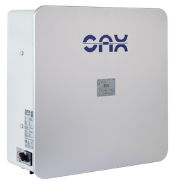
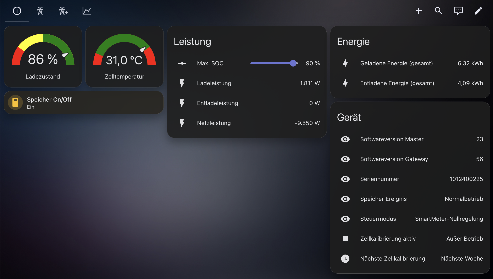
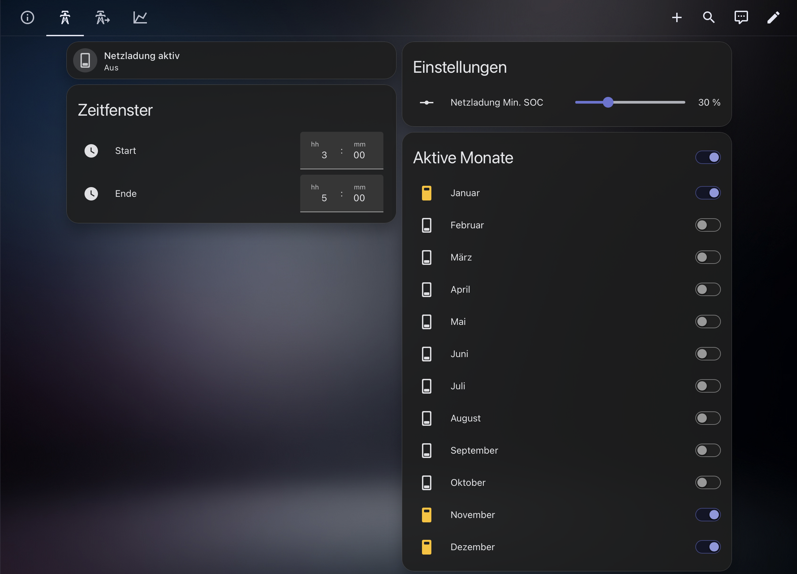
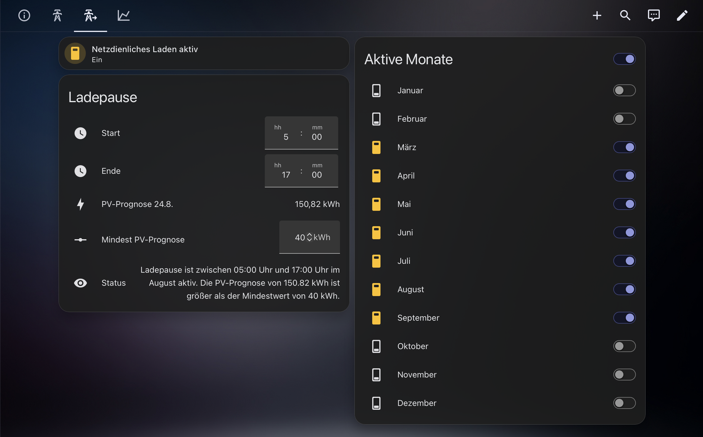
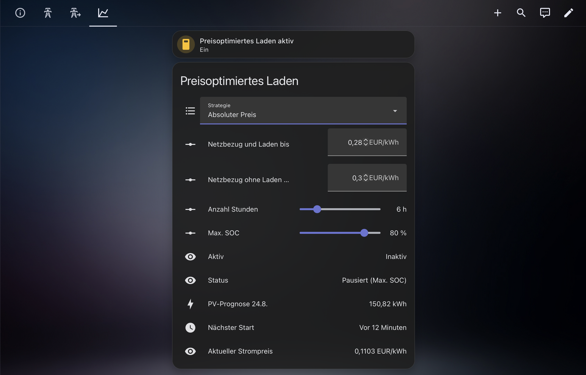

<p align="center">
  
</p>

<h1 align="center">SAX Power Home für Home Assistant</h1>

<p align="center">
  Lokale Einbindung und intelligente Ladesteuerung für SAX Power Home und
  SAX Power Home Plus.
</p>

Die Integration verbindet einen SAX Power Heimspeicher direkt über das lokale
Netzwerk mit Home Assistant. Messwerte, Einstellungen und Ladefunktionen stehen
als Entitäten zur Verfügung und lassen sich in Dashboards und Automationen
verwenden. Ein Cloud-Konto oder eine YAML-Konfiguration ist nicht erforderlich.

## Inhaltsverzeichnis

- [Funktionen](#funktionen)
- [Voraussetzungen](#voraussetzungen)
- [Installation](#installation)
- [Einrichtung](#einrichtung)
- [Wichtige Entitäten](#wichtige-entitäten)
- [Max-SOC-Sperre](#max-soc-sperre)
- [Ladefunktionen](#ladefunktionen)
  - [Zeitgesteuerte Netzladung](#zeitgesteuerte-netzladung)
  - [Netzdienliches Laden](#netzdienliches-laden)
  - [Preisoptimiertes Laden](#preisoptimiertes-laden)
- [Zeitfenster und Überschneidungen](#zeitfenster-und-überschneidungen)
- [Tarifmodell für die Wirtschaftlichkeit](#tarifmodell-für-die-wirtschaftlichkeit)
- [Herkunft der Ladeenergie](#herkunft-der-ladeenergie)
- [Wirtschaftlichkeitsbilanz](#wirtschaftlichkeitsbilanz)
- [ROI und Amortisationsprognose](#roi-und-amortisationsprognose)
- [Datenqualität, Diagnose und Bilanzneustart](#datenqualität-diagnose-und-bilanzneustart)
- [Energy-Dashboard](#energy-dashboard)
- [Aktionen für Automationen](#aktionen-für-automationen)
- [Verbindung nachträglich ändern](#verbindung-nachträglich-ändern)
- [Diagnose und Fehlersuche](#diagnose-und-fehlersuche)
- [Bekannte Einschränkungen](#bekannte-einschränkungen)
- [Hilfe und Entwicklung](#hilfe-und-entwicklung)

## Funktionen

- Ladezustand, Lade- und Entladeleistung, Netzleistung, PV-Leistung sowie
  weitere Geräte- und Akkudaten anzeigen
- Lade- und Entladeenergie im Home-Assistant-Energy-Dashboard erfassen
- geladene Energie zusätzlich nach Netz, PV und unbekannter Herkunft
  aufteilen
- Speicher ein- und ausschalten
- maximalen Ladezustand festlegen
- zeitgesteuert aus dem Netz laden
- PV-Ladung für eine bessere Nutzung der Mittagsspitze verschieben
- bei dynamischen Stromtarifen in günstigen Zeiträumen laden
- optional einen Stromtarif hinterlegen, an dem sich die Wirtschaftlichkeit
  bemisst
- daraus Netzladekosten, entgangene Einspeisevergütung, vermiedene
  Netzkosten und ein operatives Ergebnis bilanzieren
- optional aus Investitionskosten ROI, Amortisationsfortschritt und eine
  30-Tage-Amortisationsprognose berechnen
- optional ein vorbereitetes SAX-Power-Dashboard anlegen
- alle Funktionen vollständig lokal im eigenen Netzwerk nutzen

## Voraussetzungen

- Home Assistant mit HACS oder Zugriff auf das Verzeichnis
  `custom_components`
- SAX Power Home oder SAX Power Home Plus im selben Netzwerk wie Home Assistant
- aktivierte Modbus-TCP-Verbindung am Speicher
- für erweiterte Messwerte und Ladefunktionen eine kompatible Firmware
  (Master V61/Gateway V54 oder neuer empfohlen)

## Installation

### Installation über HACS

1. In Home Assistant **HACS → Integrationen** öffnen.
2. Über das Menü oben rechts **Benutzerdefinierte Repositories** auswählen.
3. `https://github.com/dr-dimitri/sax-ha` als Repository eintragen und als
   Kategorie **Integration** wählen.
4. Nach **SAX Power Home** suchen und die Integration installieren.
5. Home Assistant neu starten.

### Manuelle Installation

1. Das Verzeichnis `custom_components/sax_power` in das Verzeichnis
   `custom_components` der Home-Assistant-Konfiguration kopieren.
2. Home Assistant neu starten.

## Einrichtung

Die Einrichtung erfolgt unter **Einstellungen → Geräte & Dienste → Integration
hinzufügen**. Dort nach **SAX Power** suchen und den Anweisungen folgen.

### Verbindung zum Speicher

| Feld | Beschreibung | Standard |
| --- | --- | --- |
| IP-Adresse | Lokale IP-Adresse des Speichers | – |
| Port | Modbus-TCP-Port | 502 |
| Slave-ID (Basic Mode) | Verbindung für Grundfunktionen | 64 |
| Slave-ID (SunSpec-Modus) | Verbindung für erweiterte Mess- und Ladefunktionen | 100 |
| Aktualisierungsintervall | Intervall für grundlegende Messwerte | 10 Sekunden |

Home Assistant prüft die Verbindung vor dem Abschluss der Einrichtung. Falls
die Prüfung fehlschlägt, zunächst IP-Adresse, Port und Erreichbarkeit des
Speichers kontrollieren. Bei einem Modbus-Fehler sind meist die Slave-IDs oder
die Firmware des Speichers die Ursache.

### Netzladung vorbelegen

Im nächsten Schritt können der Schalter sowie Start- und Endzeit der
zeitgesteuerten Netzladung vorbelegt werden. Diese Angaben sind optional und
lassen sich später jederzeit über die Entitäten des Geräts ändern.

Das preisoptimierte Laden wird nach der Einrichtung über **Konfigurieren** bei
der Integration eingerichtet. So kann dort direkt der bereits vorhandene
Strompreis-Sensor ausgewählt werden.

### Mitgeliefertes Dashboard

Auf Wunsch legt die Integration bei der Einrichtung ein Dashboard namens
**SAX Power** an. Es enthält Übersichten für:

- allgemeine Informationen,
- zeitgesteuertes Laden,
- netzdienliches Laden,
- dynamisches Laden und
- Wirtschaftlichkeit (Status/Preise, Herkunft der Ladeenergie, operative
  Geldbilanz, Investition/Amortisation samt Fortschritts-Gauge sowie ein
  30-Tage-Verlaufsdiagramm - referenziert ausschließlich bereits
  bestehende Entities, siehe [ROI und Amortisationsprognose](#roi-und-amortisationsprognose)
  und [Datenqualität, Diagnose und Bilanzneustart](#datenqualität-diagnose-und-bilanzneustart)).



*Allgemeine Informationen mit Ladezustand, Leistung, Energie und Gerätedaten.*

Das Dashboard erscheint in der Seitenleiste und kann wie jedes andere
Home-Assistant-Dashboard angepasst oder entfernt werden.

Falls es später angelegt werden soll, steht unter **Entwicklertools → Aktionen**
die Aktion `sax_power.create_dashboard` zur Verfügung. Mit
`sax_power.reinstall_dashboard` lässt es sich auf den aktuellen
Auslieferungszustand zurücksetzen. Dabei werden eigene Änderungen am Dashboard
überschrieben.

## Wichtige Entitäten

Home Assistant ordnet die Entitäten automatisch dem SAX-Power-Gerät zu. Weniger
häufig benötigte Detailwerte befinden sich im Bereich **Diagnose** der
Geräteseite.

### Messwerte

Zu den wichtigsten Messwerten gehören:

- Ladezustand des Speichers
- getrennte Lade- und Entladeleistung sowie eine kombinierte Leistung
- Netzbezug und Netzeinspeisung
- PV-Leistung, sofern sie vom verwendeten Smart Meter bereitgestellt wird
- Zelltemperatur
- verfügbare Lade- und Entladeleistung
- Geräte-, Firmware- und Akkustatus

Bei der **Netzleistung** gilt die in Home Assistant übliche Darstellung:
Positive Werte stehen für Netzbezug, negative Werte für Einspeisung.

Die **Lade-/Entladeleistung** bildet beide Flussrichtungen in einer Entität
ab: Positive Werte stehen für Entladung, negative Werte für Ladung.

Die PV-Leistung ist laut Hersteller nur mit dem Smart Meter ADW200 vollständig
verfügbar. Bei anderen Smart-Meter-Modellen kann dieser Wert dauerhaft 0 W
anzeigen, obwohl die übrigen Netzwerte korrekt vorliegen.

### Einstellungen und Schalter

| Entität | Funktion |
| --- | --- |
| Max. SOC | Obergrenze für den Ladezustand und gemeinsames Ladeziel |
| Netzladung Min. SOC | Ladezustand, unterhalb dessen die zeitgesteuerte Netzladung startet |
| Speicher On/Off | Speicher ein- oder ausschalten |
| Netzladung aktiv | Zeitgesteuerte Netzladung ein- oder ausschalten |
| Netzdienliches Laden aktiv | Verschieben der PV-Ladung ein- oder ausschalten |
| Preisoptimiertes Laden aktiv | Laden nach Strompreis ein- oder ausschalten |
| Start / Ende | Zeitfenster für Netzladung und netzdienliches Laden |
| Januar bis Dezember | Monate auswählen, in denen das jeweilige Zeitfenster gilt |

Alle Einstellungen bleiben nach einem Neustart von Home Assistant erhalten.

## Max-SOC-Sperre

Mit **Max. SOC** wird der gewünschte maximale Ladezustand festgelegt. Sobald
dieser Wert erreicht ist, beendet die Integration den Ladevorgang. Die Grenze
gilt sowohl für die Ladefunktionen der Integration als auch beim Laden mit
PV-Überschuss. Bei 100 % ist die Begrenzung praktisch deaktiviert.

Beispiel: Mit **Max. SOC = 80 %** lädt der Speicher bis höchstens 80 %. Das
schafft eine Reserve und kann dabei helfen, den Akku im Alltag zu schonen.

### Regelmäßige Zellkalibrierung

Ist Max. SOC kleiner als 100 %, erlaubt die Integration alle sieben Tage eine
vollständige Ladung zur Zellkalibrierung. Die eingestellte Grenze bleibt dabei
unverändert; nur für diesen Kalibrierungsvorgang darf der Speicher 100 %
erreichen. Die Funktion startet keine zusätzliche Netzladung, sondern nutzt
die nächste reguläre Lademöglichkeit.

Die Diagnose-Entitäten **Zellkalibrierung aktiv** und **Nächste
Zellkalibrierung** zeigen den aktuellen Zustand und den nächsten Termin.

## Ladefunktionen

Die Integration bietet drei unabhängig konfigurierbare Ladefunktionen:

| Funktion | Zweck |
| --- | --- |
| [Zeitgesteuerte Netzladung](#zeitgesteuerte-netzladung) | Zu festgelegten Zeiten bis zum gewünschten Ladezustand aus dem Netz laden |
| [Netzdienliches Laden](#netzdienliches-laden) | PV-Ladung in ertragreiche Tageszeiten verschieben |
| [Preisoptimiertes Laden](#preisoptimiertes-laden) | Bei dynamischen Tarifen günstige Zeiträume nutzen |

Max. SOC gilt als gemeinsame Obergrenze für alle Ladefunktionen. Die
zeitgesteuerte und die preisoptimierte Netzladung können nicht gleichzeitig
aktiv sein. Home Assistant zeigt beim Wechsel eine Bestätigung an und schaltet
die bisher aktive Funktion erst nach Zustimmung aus.

Das netzdienliche Laden hat in seinem wirksamen Zeitfenster Vorrang vor dem
preisoptimierten Laden. Außerhalb dieses Zeitfensters läuft die
Preisoptimierung wie gewohnt weiter.

### Zeitgesteuerte Netzladung

Die zeitgesteuerte Netzladung lädt den Speicher in einem festgelegten
Zeitfenster aus dem Netz. Sie eignet sich beispielsweise für einen günstigen
Nachttarif oder zur Vorbereitung auf einen erwarteten hohen Verbrauch.



*Zeitfenster, Startschwelle und aktive Monate der Netzladung.*

Benötigte Einstellungen:

- **Netzladung aktiv**
- **Start** und **Ende**
- gewünschte Monate
- **Netzladung Min. SOC** als Startschwelle
- **Max. SOC** als Ladeziel

Beispiel: Bei einem Zeitfenster von 01:00 bis 05:00 Uhr, Min. SOC von 40 % und
Max. SOC von 90 % startet die Netzladung nur, wenn der Ladezustand unter 40 %
liegt. Anschließend lädt sie bis 90 % oder bis zum Ende des Zeitfensters.

Zeitfenster über Mitternacht, etwa 23:00 bis 05:00 Uhr, werden unterstützt.
Sind Start und Ende identisch oder ist eine Zeit nicht gesetzt, bleibt die
Funktion inaktiv. Wenn ausreichend eigener PV-Strom zur Verfügung steht, wird
die Netzladung beendet und der Speicher nutzt die Sonnenenergie.

### Netzdienliches Laden

Das netzdienliche Laden verschiebt die Aufnahme von PV-Überschuss in ein
späteres Zeitfenster. Dadurch bleibt morgens mehr freie Speicherkapazität für
die ertragreiche Mittagszeit und Einspeisespitzen können reduziert werden.



*Ladepause, PV-Prognose und aktive Monate des netzdienlichen Ladens.*

Typische Einstellungen sind beispielsweise die Monate Mai bis August und eine
Ladepause am Vormittag. Außerhalb der ausgewählten Monate und Zeiten arbeitet
der Speicher normal.

Benötigte Einstellungen:

- **Netzdienliches Laden aktiv**
- **Start** und **Ende** der Ladepause
- gewünschte Monate
- optional **Mindest-PV-Prognose**

#### Mindest-PV-Prognose

Über **Einstellungen → Geräte & Dienste → SAX Power Home → Konfigurieren** kann
ein PV-Prognose-Sensor ausgewählt werden. Die Einstellung **Netzdienliches
Laden Mindest-PV-Prognose** bestimmt anschließend, ab welcher erwarteten
PV-Energie die Ladepause gilt.

- **0 kWh:** Die Prognoseprüfung ist ausgeschaltet.
- Prognose erreicht den Mindestwert: Die Ladepause wird angewendet.
- Prognose liegt darunter oder ist nicht verfügbar: Der Speicher darf bereits
  früher laden.

Beispiel: Für eine Ladepause von 08:00 bis 13:00 Uhr und einen Mindestwert von
8 kWh greift die Pause nur an Tagen, an denen mindestens 8 kWh PV-Ertrag
prognostiziert werden.

### Preisoptimiertes Laden

Das preisoptimierte Laden verwendet einen bereits in Home Assistant
vorhandenen Strompreis-Sensor. Die Integration selbst ruft keine Strompreise
von einem Anbieter ab. Geeignet sind beispielsweise Sensoren von Tibber,
Nordpool, EPEX Spot, ENTSO-E oder aWATTar sowie entsprechend aufgebaute
Template-Sensoren.



*Strategie, Preisgrenzen, Status und Planung des preisoptimierten Ladens.*

#### Einrichtung

Unter **Einstellungen → Geräte & Dienste → SAX Power Home → Konfigurieren**
stehen folgende Angaben zur Verfügung:

| Feld | Beschreibung |
| --- | --- |
| Strompreis-Sensor | Sensor mit aktuellem Preis und, je nach Strategie, zukünftigen Preisen |
| Attribut mit der Preisvorschau | Optionaler Attributname, falls die automatische Erkennung nicht passt |
| Preis-Einheit | Automatische Erkennung oder feste Auswahl von EUR/kWh beziehungsweise ct/kWh |
| PV-Prognose-Sensor | Optional für die Strategie „Smart“ und das netzdienliche Laden |
| Nutzbarer Anteil der PV-Prognose | Erwarteter Anteil der Prognose, der zum Laden verfügbar ist |

Anschließend die gewünschte **Strategie** wählen und den Schalter
**Preisoptimiertes Laden aktiv** einschalten.

#### Strategien

| Strategie | Verhalten |
| --- | --- |
| Manuell / Aus | Preisautomatik ist ausgeschaltet, Einstellungen bleiben erhalten |
| Absoluter Preis | Lädt, solange der aktuelle Preis die festgelegte Preisgrenze nicht überschreitet |
| Relativ / Günstigste Stunden | Nutzt die eingestellte Anzahl der günstigsten Stunden im verfügbaren Vorschauzeitraum |
| Smart / PV-optimiert | Berücksichtigt zusätzlich Ladezustand, Speicherkapazität und PV-Prognose |

Für **Relativ** und **Smart** wird ein Preis-Sensor mit zukünftigen Preisen
benötigt. Die Planung betrachtet die bekannten Preise der kommenden 24
Stunden. Sind noch keine Preise für den nächsten Tag verfügbar, plant die
Integration mit den bereits bekannten Zeiträumen.

Bei der Smart-Strategie reduziert eine erwartete PV-Erzeugung den aus dem Netz
zu ladenden Energiebedarf. Deckt die Prognose den Bedarf vollständig, findet
keine Netzladung statt. Die Einstellung **Anzahl Stunden** bleibt die maximale
zulässige Ladedauer.

#### Preisgrenze und Neutralpreis

Die beiden Preiswerte teilen den Tarif in drei Bereiche:

| Preisbereich | Verhalten |
| --- | --- |
| Geplanter günstiger Zeitraum | Speicher wird aus dem Netz geladen |
| Preis zwischen Preisgrenze und Neutralpreis | Speicher pausiert; der Hausverbrauch wird aus dem Netz gedeckt |
| Preis ab Neutralpreis | Speicher steht wieder für den normalen Betrieb zur Verfügung |

Der Neutralpreis muss über der Preisgrenze liegen. Andernfalls weist Home
Assistant unter **Einstellungen → Geräte & Dienste → Reparaturen** darauf hin.

Der Sensor **Preisoptimiertes Laden Status** erklärt den aktuellen Zustand,
beispielsweise **Lade aus Netz**, **Warten auf Preisabfall**, **Keine
Preisdaten** oder **PV-Prognose deckt Bedarf**. Der Sensor **Nächster Start**
zeigt das nächste geplante Ladefenster.

## Zeitfenster und Überschneidungen

Die Zeitfenster der zeitgesteuerten Netzladung und des netzdienlichen Ladens
dürfen sich in denselben Monaten nicht überschneiden. Die Integration prüft
dies automatisch.

- Bei einer unzulässigen Monatsauswahl wird die Änderung abgelehnt.
- Bei einer unzulässigen Änderung von Start oder Ende wird die geänderte Zeit
  geleert und Home Assistant zeigt eine Benachrichtigung an.

Zeitlich identische Fenster sind zulässig, wenn sie ausschließlich in
verschiedenen Monaten aktiv sind. Für Automationen können Start und Ende mit
den Aktionen `sax_power.set_timed_charge_window` und
`sax_power.set_grid_serving_window` gemeinsam gesetzt werden.

## Tarifmodell für die Wirtschaftlichkeit

Damit die Integration bewerten kann, was eine Kilowattstunde aus dem Netz
tatsächlich kostet, lässt sich unter **Einstellungen → Geräte & Dienste →
SAX Power Home → Konfigurieren** ein Tarifmodell hinterlegen. Die
Konfiguration ist vollständig optional: Solange **Deaktiviert** eingestellt
ist, arbeitet die Integration exakt wie bisher. Bestehende Installationen
werden nicht automatisch umgestellt.

| Tarifmodell | Bedeutung |
| --- | --- |
| Deaktiviert | Keine Wirtschaftlichkeitsauswertung (Vorgabe) |
| Festpreis | Ein ganztägig konstanter Arbeitspreis |
| Tageszeitabhängig | Ein Grundpreis und bis zu acht abweichende Zeitfenster |
| Dynamisch | Der aktuelle Preis aus dem bereits ausgewählten Strompreis-Sensor |

Bei jedem aktivierten Tarif ist zusätzlich die **Einspeisevergütung**
erforderlich. Sie ist der entgangene Erlös und damit der Beschaffungspreis
jeder PV-Kilowattstunde, die in den Speicher statt ins Netz fließt – PV-Strom
gilt in dieser Rechnung nie als kostenlos.

Alle Preise sind variable Brutto-Arbeitspreise in EUR/kWh. Monatlicher
Grundpreis, Boni, außerhalb des Arbeitspreises ausgewiesene Steuern und
sonstige Fixkosten gehören ausdrücklich nicht dazu.

### Tageszeitabhängige Zeitfenster

- Ein Zeitfenster beginnt einschließlich seiner Startzeit und endet
  ausschließlich seiner Endzeit.
- Start und Ende dürfen nicht gleich sein; das ergibt kein Zeitfenster und
  bedeutet auch nicht „ganzer Tag“.
- Ein Zeitfenster darf über Mitternacht gehen.
- Zwei Zeitfenster dürfen sich nicht überschneiden. Angrenzende Grenzen
  (Ende des einen = Beginn des nächsten) sind erlaubt.
- Außerhalb aller Zeitfenster gilt der Grundpreis.
- Maßgeblich ist die in Home Assistant eingestellte Zeitzone. In der Nacht
  der Sommerzeitumstellung gilt die Ortszeit: die im Frühjahr übersprungene
  Stunde tritt nicht auf, die im Herbst doppelte Stunde wird beide Male
  gleich bewertet.
- Jede der acht Gruppen wird entweder vollständig ausgefüllt oder bleibt
  ganz leer.

Der dynamische Tarif nutzt bewusst denselben Strompreis-Sensor samt dessen
Attribut- und Einheiteneinstellung wie das preisoptimierte Laden – es gibt
keine zweite Preisquelle. Ohne ausgewählten Sensor lässt sich dieses
Tarifmodell nicht speichern. Liefert der Sensor keinen brauchbaren Wert
(unbekannt, nicht verfügbar, keine Zahl, fremde Einheit, ein Preis außerhalb
von -2 bis 5 EUR/kWh oder eine Preisvorschau, die unlesbar ist oder den
aktuellen Zeitpunkt nicht abdeckt), gilt der Preis als unbekannt; er wird nie
durch 0 EUR/kWh ersetzt. Der Grund steht im Diagnose-Download.

Bringt der Sensor eine Preisvorschau mit, ist sie verbindlich – der
Sensorzustand wird nur dann als aktueller Preis verwendet, wenn gar keine
Vorschau vorliegt. Ein im Feld **Attribut mit der Preisvorschau** ausdrücklich
angegebenes Attribut gilt dabei bereits als Vorschau, sobald es überhaupt
einen Wert enthält.

Änderungen am Tarifmodell wirken sofort und ohne Neustart der Integration –
allerdings nur für zukünftige Messintervalle. Bereits erfasste Geldbeträge
werden nie rückwirkend neu bewertet.

Unabhängig von der gewählten Tarifart lässt sich auf derselben Seite
optional ein Feld **Investitionskosten (EUR)** ausfüllen. Es schaltet die in
[ROI und Amortisationsprognose](#roi-und-amortisationsprognose) beschriebenen
Sensoren frei; ein Wechsel des Tarifmodells löscht diesen Wert nicht.

### Beispiele je Tarifart

Alle drei Beispiele gehen von derselben Einspeisevergütung (0,08 EUR/kWh)
sowie von 1 kWh Netzladung, 1 kWh PV-Ladung und 1 kWh späterer Entladung
aus - nur der zum jeweiligen Zeitpunkt gültige Netzbezugspreis
unterscheidet sich:

- **Festpreis** (0,30 EUR/kWh ganztägig): Netzladekosten = 1 kWh × 0,30
  EUR/kWh = 0,30 EUR. PV-Opportunitätskosten = 1 kWh × 0,08 EUR/kWh = 0,08
  EUR. Vermiedene Netzkosten (Entladung um 0,30 EUR/kWh) = 1 kWh × 0,30
  EUR/kWh = 0,30 EUR. Operatives Ergebnis = 0,30 − 0,30 − 0,08 = **−0,08
  EUR**.
- **Tageszeitabhängig** (Grundpreis 0,25 EUR/kWh, Zeitfenster 17:00–20:00
  Uhr zu 0,40 EUR/kWh): Lädt die Netzladung innerhalb des Zeitfensters,
  kosten die 1 kWh 0,40 EUR statt 0,25 EUR - außerhalb des Fensters gilt
  durchgehend der Grundpreis. PV-Opportunitätskosten und die Bewertung
  einer späteren Entladung folgen exakt derselben Formel wie beim
  Festpreis, nur mit dem zum jeweiligen Zeitpunkt gültigen Preis.
- **Dynamisch** (Strompreis-Sensor liefert z. B. 0,22 EUR/kWh zum
  Ladezeitpunkt, 0,35 EUR/kWh zum späteren Entladezeitpunkt):
  Netzladekosten = 1 kWh × 0,22 EUR/kWh = 0,22 EUR, vermiedene Netzkosten
  = 1 kWh × 0,35 EUR/kWh = 0,35 EUR - Laden und Entladen werden bewusst
  mit dem jeweils zu ihrem eigenen Zeitpunkt gültigen Preis bewertet, nie
  mit einem einzigen "aktuellen" Preis für beide Vorgänge.

### Formeln im Überblick

```
Netzladekosten          = geladene Netzenergie (kWh) × Netzbezugspreis zum Ladezeitpunkt
PV-Opportunitätskosten  = geladene PV-Energie (kWh) × Einspeisevergütung
Vermiedene Netzkosten   = monetarisierbare Entladung (kWh) × Netzbezugspreis zum Entladezeitpunkt
Operatives Ergebnis     = Vermiedene Netzkosten − Netzladekosten − PV-Opportunitätskosten
ROI (%)                 = Operatives Ergebnis ÷ Investitionskosten × 100
Amortisationsfortschritt (%) = ROI, auf 0 bis 100 % begrenzt
Restbetrag              = max(Investitionskosten − Operatives Ergebnis, 0)
30-Tage-Prognose        = Durchschnitt der letzten 30 abgeschlossenen Tagesergebnisse
Jahreshochrechnung      = 30-Tage-Durchschnitt × 365,2425
```

### Grenzen der Wirtschaftlichkeitsauswertung

- Die Herkunftsaufteilung (Netz/PV/unbekannt) ist eine **Schätzung am
  Netzanschlusspunkt** (siehe [Herkunft der Ladeenergie](#herkunft-der-ladeenergie)),
  keine physikalische Einzelstromverfolgung.
- Monatlicher Grundpreis, Finanzierungskosten, Wartung und
  Batteriealterung sind **nicht Bestandteil** dieser Rechnung - das
  operative Ergebnis bildet ausschließlich die reinen Arbeitspreis-
  Zahlungsströme ab.
- Die 30-Tage-Prognose und das geschätzte Amortisationsdatum sind
  **keine Garantie**: Sie schreiben die letzten 30 Tage unverändert fort
  und reagieren nicht auf künftige Preis-, Verbrauchs- oder
  Nutzungsänderungen.
- Eine Änderung des Tarifmodells oder der Investitionskosten wirkt
  ausschließlich prospektiv - bereits verbuchte Beträge und eine bereits
  erreichte Amortisation werden nie rückwirkend neu berechnet.

## Herkunft der Ladeenergie

Zusätzlich zu **Geladene Energie (gesamt)** zeigen drei weitere Sensoren, wie
viel der geladenen Energie rechnerisch aus dem Netz, aus PV und aus einer
nicht sicher bestimmbaren Quelle stammt:

- **Geladene Energie aus dem Netz**
- **Geladene Energie aus PV**
- **Geladene Energie, Herkunft unbekannt**

Diese Aufteilung funktioniert unabhängig davon, ob unter
[Tarifmodell für die Wirtschaftlichkeit](#tarifmodell-für-die-wirtschaftlichkeit)
eine Geldbewertung aktiviert ist, und ist eine **Schätzung anhand des
Netzanschlusspunktes**, keine physikalisch eindeutige Zuordnung: Bei
gleichzeitigem Hausverbrauch lässt sich aus Ladeleistung und Netzleistung
allein nicht herleiten, welcher Anteil der PV-Erzeugung tatsächlich in den
Speicher statt in den Hausverbrauch geflossen ist. Netzbezug, der die
aktuelle Ladeleistung übersteigt (er deckt dann zusätzlich laufenden
Hausverbrauch), zählt deshalb konservativ vollständig als Netzladung. Ist der
Netzwert selbst gerade nicht bekannt, zählt die Ladeenergie dieses Zeitraums
als "Herkunft unbekannt" statt geraten der einen oder anderen Quelle
zugeschlagen zu werden. Der diagnostische Sensor **Herkunftsabdeckung
Ladeenergie** zeigt den Anteil der seit Beginn der Zählung eindeutig Netz
oder PV zugeordneten Ladeenergie in Prozent.

Die Herkunftszählung beginnt mit der ersten Installation dieser Funktion bei
0 kWh - bereits vorher geladene Energie wird nicht nachträglich einer Quelle
zugeordnet, der bestehende Gesamtzähler **Geladene Energie (gesamt)** bleibt
davon unberührt.

## Wirtschaftlichkeitsbilanz

Ist unter [Tarifmodell für die Wirtschaftlichkeit](#tarifmodell-für-die-wirtschaftlichkeit)
ein Tarif aktiviert, bilanziert die Integration zusätzlich zur reinen
[Herkunft der Ladeenergie](#herkunft-der-ladeenergie) einen fortlaufenden
Geldwert. Bewertet wird ausschließlich tatsächlich gemessene Lade-/
Entladeenergie, nie ein Sollwert:

- **Netzladekosten**: geladene Netzenergie zum jeweils zum Ladezeitpunkt
  gültigen Netzbezugspreis.
- **PV-Opportunitätskosten**: geladene PV-Energie zur eingestellten
  Einspeisevergütung - PV-Strom gilt nie als kostenlos, weil er statt in den
  Speicher auch hätte eingespeist werden können.
- **Vermiedene Netzkosten**: entladene Energie zum jeweils zum
  Entladezeitpunkt gültigen Netzbezugspreis, also der Betrag, den der
  Hausverbrauch dadurch nicht aus dem Netz decken musste.
- **Operatives Ergebnis**: vermiedene Netzkosten abzüglich Netzladekosten
  und PV-Opportunitätskosten - ein kumulierter operativer Cashflow, kein
  Kontostand. Ladeverluste werden dadurch automatisch sichtbar: Kosten
  entstehen für die volle geladene Energie, Nutzen nur für die tatsächlich
  wieder entladene, ohne dass dafür ein angenommener Wirkungsgrad nötig
  wäre. Kann negativ sein.

Zusätzlich zeigen zwei Diagnosesensoren, welcher Anteil der Ladeenergie
(noch) nicht bewertet werden konnte: **Unbepreiste Ladeenergie**/
**Unbepreiste Entladeenergie** (z. B. weil der dynamische Preis-Sensor
kurzzeitig ausgefallen war) sowie der **Unbewertete Energiebestand**
(Herkunft-unbekannt- und unbepreist geladene Energie, die noch im Speicher
liegt). Die Sensoren **Aktueller Netzbezugspreis** und
**Einspeisevergütung** zeigen den gerade angewendeten Tarif.

**Ehrlicher Start:** Bereits vor der Aktivierung im Speicher liegende
Energie ist unbekannter Herkunft. Damit ihr späteres Entladen keinen
kostenlosen Scheingewinn erzeugt, initialisiert die Integration beim
erstmaligen Aktivieren den unbewerteten Energiebestand aus der aktuellen
Kapazität und dem aktuellen Ladezustand - jede Entladung verbraucht zuerst
diesen Bestand, ohne dabei vermiedene Netzkosten zu erzeugen. Erst danach
gilt eine Entladung als vermiedener Netzbezug. Eine spätere Tarifänderung
wirkt ausschließlich auf künftige Beträge; bereits verbuchte Werte bleiben
unverändert.

Monetäre Sensoren zeigen "unbekannt" statt 0, solange kein Tarif aktiviert
ist oder die Bilanz noch auf Kapazität/Ladezustand wartet - ein
deaktivierter Tarif soll keinen falschen Nullgewinn suggerieren.

## ROI und Amortisationsprognose

Wird zusätzlich zum Tarif ein Feld **Investitionskosten (EUR)** ausgefüllt
(siehe [Tarifmodell für die Wirtschaftlichkeit](#tarifmodell-für-die-wirtschaftlichkeit)),
setzt die Integration das [operative Ergebnis](#wirtschaftlichkeitsbilanz) in
Bezug zu dieser Investition:

- **ROI**: operatives Ergebnis in Prozent der Investitionskosten - bewusst
  unbegrenzt, also auch negativ (bislang Verlust) oder über 100 % (bereits
  mehrfach amortisiert).
- **Amortisationsfortschritt**: derselbe Wert, aber auf 0 bis 100 %
  begrenzt - für eine Fortschrittsanzeige.
- **Restbetrag bis Amortisation**: Investitionskosten abzüglich operativem
  Ergebnis, nie unter 0 EUR.
- **Operatives Ergebnis heute**: nur der auf den laufenden Kalendertag
  entfallende Anteil des operativen Ergebnisses.

Alle sieben Sensoren dieses Abschnitts zeigen "unbekannt", solange keine
Investitionskosten hinterlegt sind. Von den vier oben genannten Sensoren
blenden zusätzlich bei deaktiviertem Tarif auf "unbekannt" wie die Sensoren
der Wirtschaftlichkeitsbilanz - der interne Stand läuft in beiden Fällen
unverändert weiter.

Zusätzlich berechnet die Integration eine **30-Tage-Prognose** aus genau
den jüngsten 30 zusammenhängenden, vollständig abgeschlossenen
Kalendertagen (der laufende Tag zählt nie mit): **Durchschnittliches
Tagesergebnis (30 Tage)** und die daraus hochgerechnete **Hochgerechnetes
Jahresergebnis** (Durchschnitt × 365,2425 Tage). Ist bereits ein
ausreichend positiver Durchschnitt und ein offener Restbetrag bekannt,
zeigt **Voraussichtliches Amortisationsdatum** das daraus abgeleitete
Datum. Die Prognose braucht lückenlos genau diese 30 aufeinanderfolgenden
Kalendertage - fehlt auch nur einer davon (etwa nach einem längeren
Ausfall von Home Assistant), bleibt sie "unbekannt", statt ältere Tage als
Lückenfüller zu verwenden. Sie verlangt außerdem von jedem einzelnen
dieser 30 Tage eine Preisabdeckung von mindestens 95 % - fehlt einem
einzigen Tag ausreichend Preisinformation, bleibt die gesamte Prognose
"unbekannt" statt einen verzerrten Wert zu zeigen. Genauso muss jeder
dieser 30 Tage zu mindestens 95 % tatsächlich beobachtet worden sein: War
Home Assistant an einem Tag längere Zeit aus (Neustart, Update,
Stromausfall), enthält dieser Tag nur einen Teil seines Ergebnisses und
würde Durchschnitt, Hochrechnung und Amortisationsdatum zu pessimistisch
machen - auch dann bleibt die Prognose lieber "unbekannt". Kurze
Neustarts von wenigen Minuten sind davon nicht betroffen. Ein nicht
positiver
Durchschnitt lässt nur das Rückzahlungsdatum unbekannt; Durchschnitt und
Hochrechnung werden trotzdem angezeigt, nie ein erfundenes Datum. Anders
als die vier "aktuellen" Sensoren bleibt diese Prognose - einschließlich
des Rückzahlungsdatums - während einer Tarifpause sichtbar, weil sie
ausschließlich auf bereits abgeschlossenen Tagen beruht.

Ist die Investition einmal tatsächlich amortisiert, bleibt das
Amortisationsdatum dauerhaft auf diesem historischen Kalendertag stehen -
eine spätere Änderung der Investitionskosten verschiebt es nicht mehr
rückwirkend.

## Datenqualität, Diagnose und Bilanzneustart

Eine Geldzahl ohne Aussage zur Datenqualität ist irreführend. Der Sensor
**Wirtschaftlichkeit Status** zeigt deshalb auf einen Blick, ob und warum
der Wirtschaftlichkeitsbilanz gerade zu trauen ist:

| Status | Bedeutung |
| --- | --- |
| Deaktiviert | Kein Tarif konfiguriert (siehe [Tarifmodell für die Wirtschaftlichkeit](#tarifmodell-für-die-wirtschaftlichkeit)) |
| Wartet auf Initialwerte | Tarif aktiv, aber Speicherkapazität/Ladezustand noch nicht bekannt |
| Speicherfehler | Der interne Bilanz-Speicher ist unlesbar - die Bilanz pausiert, bis die Integration neu geladen wird |
| Preis nicht verfügbar | Seit über 6 Stunden kein gültiger Netzbezugspreis (bei einem Fest-/Zeitfenstertarif sofort, wenn die gespeicherte Konfiguration selbst ungültig ist) |
| Herkunft nicht verfügbar | Die Herkunftsaufteilung aus [Herkunft der Ladeenergie](#herkunft-der-ladeenergie) läuft gerade nicht |
| Teilweise Preisabdeckung | Ein Teil der geladenen oder entladenen Energie konnte (noch) nicht bepreist werden |
| Aktiv | Alles vollständig - die Bilanz ist ohne Einschränkung aussagekräftig |

Bei mehreren gleichzeitig zutreffenden Problemen zeigt der Sensor immer
das dringendste in dieser Reihenfolge. Seine Attribute liefern zusätzlich
die aktuellen Preise, den Aktivierungszeitpunkt, kumulierte bepreiste/
unbepreiste Energiemengen sowie die genauen Abdeckungsprozentsätze - für
Dashboards und Automationen, die feiner reagieren wollen als der reine
Status.

Bleibt der interne Bilanz-Speicher länger als 6 Stunden unlesbar oder
liegt ebenso lange kein gültiger Netzbezugspreis vor, erscheint zusätzlich
ein Reparaturhinweis unter **Einstellungen → System → Reparaturen**, der
sich automatisch wieder auflöst, sobald die Ursache behoben ist.

Bei einer fehlerhaften Konfiguration (z. B. einem versehentlich falsch
eingegebenen Tarif) lässt sich über den Service **Wirtschaftlichkeitsbilanz
neu starten** (`sax_power.restart_economics_accounting`) eine neue,
prospektive Bilanz beginnen: Alle bisherigen Geldsummen, Preisabdeckungs-
zähler und die Amortisationshistorie werden zurückgesetzt, der unbekannte
Anfangsbestand wird wie bei der erstmaligen Aktivierung neu ermittelt. Der
Aufruf verlangt zur Sicherheit das Feld **Bestätigen** exakt auf „wahr“
gesetzt und akzeptiert optional einen freien **Grund**-Text, der
ausschließlich im Diagnose-Download erscheint. Die Energiezähler
(**Geladene/Entladene Energie**) und die Herkunftsaufteilung aus
[Herkunft der Ladeenergie](#herkunft-der-ladeenergie) bleiben davon
vollständig unberührt - es gibt keine rückwirkende Neuberechnung.

## Energy-Dashboard

Die Sensoren **Geladene Energie (gesamt)** und **Entladene Energie (gesamt)**
lassen sich direkt als Batteriesystem verwenden:

**Einstellungen → Dashboards → Energie → Batteriesysteme**

Dort den ersten Sensor für die in den Speicher geladene und den zweiten für
die aus dem Speicher entladene Energie auswählen. Die Zählerstände bleiben
über Neustarts hinweg erhalten.

## Aktionen für Automationen

Alle Aktionen werden unter **Entwicklertools → Aktionen** ausgeführt und über
das Feld `device_id` dem gewünschten SAX-Power-Gerät zugeordnet.

| Aktion | Verwendung |
| --- | --- |
| `sax_power.start_grid_charge` | Manuelle Netzladung mit einem strikt negativen Leistungssollwert starten oder sofort aktualisieren |
| `sax_power.stop_grid_charge` | Manuelle Netzladung kontrolliert beenden und die SmartMeter-Regelung wieder freigeben |
| `sax_power.set_timed_charge_window` | Start und Ende der zeitgesteuerten Netzladung gemeinsam setzen |
| `sax_power.set_grid_serving_window` | Start und Ende des netzdienlichen Ladens gemeinsam setzen |
| `sax_power.refresh_price_plan` | Ladeplan nach aktualisierten Preisdaten sofort neu berechnen |
| `sax_power.set_price_charge_enabled` | Preisoptimiertes Laden per Automation schalten |
| `sax_power.create_dashboard` | Mitgeliefertes Dashboard nachträglich anlegen |
| `sax_power.reinstall_dashboard` | Dashboard auf den Auslieferungszustand zurücksetzen |

Die für eine Aktion verfügbaren Felder und Beschreibungen zeigt Home Assistant
direkt im Aktionseditor an. Für den normalen Betrieb werden die manuellen
Aktionen zum Starten und Stoppen einer Netzladung nicht benötigt.

`sax_power.start_grid_charge` akzeptiert ausschließlich ganzzahlige
Ladesollwerte von **-32768 bis -1 W**. Null, positive Werte und damit eine
manuelle Entladung werden abgelehnt. Der Aufruf verwendet denselben zentralen
SunSpec-Steuerpfad wie die Ladeautomatiken und wartet, bis der erste wirksame
Schreibvorgang vom Speicher quittiert wurde. Eine erneute Start-Aktion ändert
den Sollwert sofort. Es gilt stets die Priorität **Max-SOC-Sperre → manuelle
Netzladung → zeitgesteuertes Laden → netzdienliches Laden → preisoptimiertes
Laden**. `sax_power.stop_grid_charge` wartet das Ende des gemeinsamen
Schreib-Tasks ab, versucht aktiv zur SmartMeter-Nullregelung zurückzukehren und
gibt danach weiterhin berechtigte Automatiken wieder frei.

## Verbindung nachträglich ändern

IP-Adresse, Port, Slave-IDs und Aktualisierungsintervall lassen sich jederzeit
anpassen:

**Einstellungen → Geräte & Dienste → SAX Power Home → Neu konfigurieren**

Die neuen Verbindungsdaten werden vor dem Speichern geprüft. Nach erfolgreicher
Prüfung lädt Home Assistant die Integration automatisch neu.

## Diagnose und Fehlersuche

| Problem | Mögliche Ursache und Lösung |
| --- | --- |
| Verbindung kann nicht hergestellt werden | IP-Adresse und Port prüfen und sicherstellen, dass Home Assistant den Speicher im lokalen Netzwerk erreicht |
| Modbus-Fehler bei der Einrichtung | Slave-IDs prüfen; die Standardwerte sind 64 und 100 |
| Viele Detailwerte sind unbekannt | SunSpec-Slave-ID und Firmware prüfen; empfohlen werden Master V61/Gateway V54 oder neuer |
| Ladefunktionen reagieren nicht | Erreichbarkeit des SunSpec-Modus sowie Statussensoren und ausgewählte Monate prüfen |
| Netzladung startet nicht | Zeitfenster, aktive Monate, Min. SOC und Max. SOC kontrollieren |
| Preisoptimiertes Laden zeigt „Keine Preisdaten“ | Preis-Sensor, Vorschauattribut und Preis-Einheit unter **Konfigurieren** prüfen |
| Zeitangabe wurde geleert | Zeitfenster von Netzladung und netzdienlichem Laden überschneiden sich |
| PV-Leistung zeigt dauerhaft 0 W | Der verwendete Smart Meter stellt diesen Wert möglicherweise nicht bereit |

Unter **Einstellungen → Geräte & Dienste → SAX Power Home → Diagnose
herunterladen** kann eine Diagnosedatei erstellt werden. Sie enthält die für
die Fehlersuche relevanten Zustände; die IP-Adresse wird dabei unkenntlich
gemacht. Die Datei kann einem Fehlerbericht auf GitHub beigefügt werden.

## Bekannte Einschränkungen

- Eine ferngesteuerte manuelle Entladung wird vom Speicher nicht unterstützt.
- Erweiterte Messwerte und Ladefunktionen benötigen den SunSpec-Modus. Die
  grundlegenden Messwerte bleiben auch dann verfügbar, wenn dieser Modus nicht
  erreichbar ist.
- Die Strategien **Relativ** und **Smart** benötigen zukünftige Preisdaten. Mit
  einem Sensor, der nur den aktuellen Preis liefert, steht weiterhin die
  Strategie **Absoluter Preis** zur Verfügung.
- Die Strategie **Smart** benötigt zusätzlich Speicherkapazität und
  PV-Prognose. Fehlen diese Angaben, verhält sie sich wie **Relativ**.

## Hilfe und Entwicklung

Fehler und Verbesserungsvorschläge können über die
[GitHub-Issues](https://github.com/dr-dimitri/sax-ha/issues) gemeldet werden.
Für eine zügige Analyse bitte die Home-Assistant-Version, die Firmware des
Speichers, eine kurze Beschreibung des beobachteten Verhaltens und nach
Möglichkeit die Diagnosedatei angeben.

Technische Informationen für Mitwirkende befinden sich in:

- [DEVELOPMENT.md](DEVELOPMENT.md) – Architektur, lokale Entwicklung und Tests
- [anforderung.yaml](anforderung.yaml) – vollständige Verhaltensanforderungen
- [AGENTS.md](AGENTS.md) – Arbeitsregeln für Coding-Agenten
