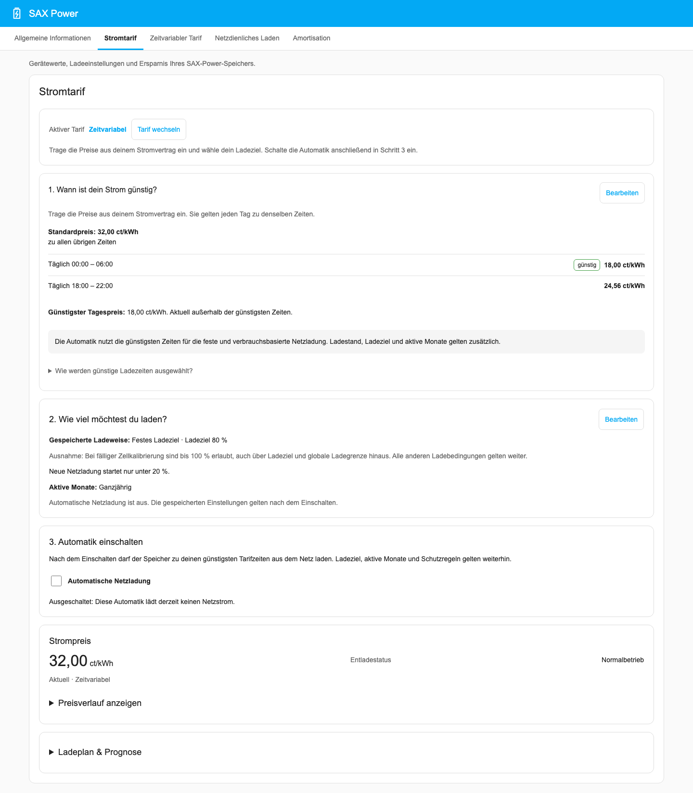
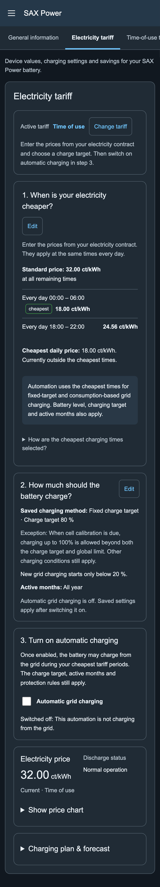
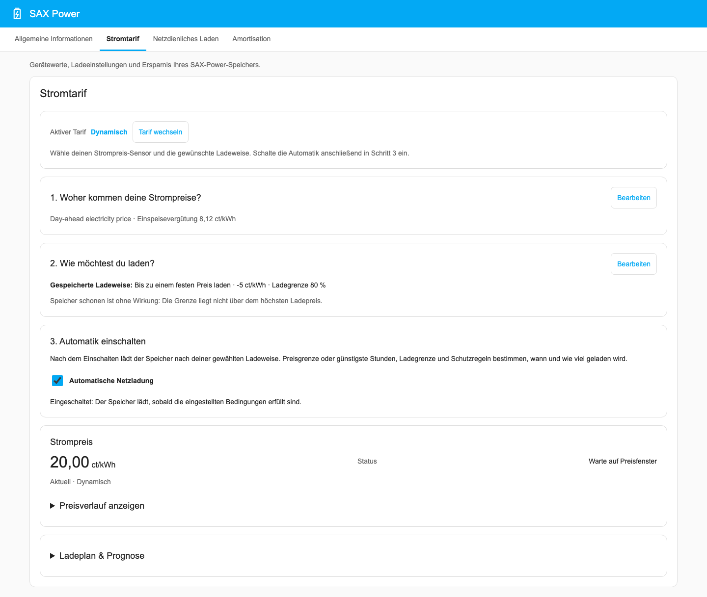
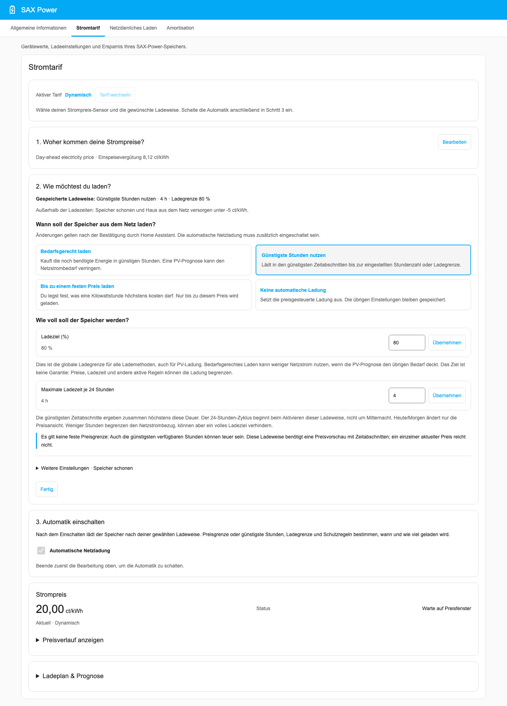

<p align="center">
  
</p>

<h1 align="center">SAX Power Home für Home Assistant</h1>

<p align="center">
  Den Speicher im Blick. Laden, wenn es passt.
</p>

Diese Integration verbindet deinen **SAX Power Home oder Home Plus** über
Modbus TCP mit Home Assistant. Du siehst, was der Speicher gerade macht,
legst Ladezeiten und Ladegrenzen fest und kannst seine Ersparnis verfolgen.
Alles läuft im lokalen Netzwerk, ohne Cloud-Konto und ohne YAML-Konfiguration.


- **Messwerte:** Ladezustand, Leistung, Temperatur und Energiezähler für eigene
  Dashboards und Automationen.
- **Ladesteuerung:** feste Ladezeiten, günstige Börsenpreise oder eine
  Ladepause für die PV-Mittagsspitze.
- **Ladegrenze:** einen maximalen Ladezustand für Netz- und PV-Ladung festlegen.
- **Wirtschaftlichkeit:** Kosten, Netto-Ersparnis und Amortisationsstand mit
  deinem Tarif berechnen.
- **Dashboard:** eine eigene SAX-Power-Ansicht für Computer und Smartphone,
  auf Deutsch und Englisch, im hellen oder dunklen Design.

[Installation](#installation) · [Einrichtung](#einrichtung) ·
[Dashboard](#dashboard) · [Ladefunktionen](#ladefunktionen) ·
[Wirtschaftlichkeit](#tarifmodell-für-die-wirtschaftlichkeit) ·
[Fehlersuche](#diagnose-und-fehlersuche)

## Voraussetzungen

- **Home Assistant ab 2026.8.2**
- **SAX Power Home oder Home Plus** mit aktiviertem Modbus TCP, im selben
  Netzwerk wie Home Assistant
- Für erweiterte Messwerte und Ladefunktionen: kompatible Firmware,
  empfohlen **Master V61 / Gateway V54 oder neuer**

Derzeit wird **ein SAX-Speicher je Home-Assistant-Installation** unterstützt.

## Installation

### Über HACS

1. **HACS → Integrationen → Benutzerdefinierte Repositories** öffnen.
2. `https://github.com/dr-dimitri/sax-ha` eintragen und **Integration** wählen.
3. Nach **SAX Power Home** suchen und installieren.
4. Home Assistant neu starten.

### Manuell

Den Ordner [`custom_components/sax_power`](custom_components/sax_power) in
`custom_components` deiner Home-Assistant-Konfiguration kopieren und
Home Assistant neu starten.

## Einrichtung

Unter **Einstellungen → Geräte & Dienste → Integration hinzufügen** nach
**SAX Power** suchen. Du brauchst die IP-Adresse des Speichers; die übrigen
Verbindungswerte kannst du normalerweise übernehmen:

| Einstellung | Standard |
| --- | --- |
| Port | 502 |
| Slave-ID, Basic Mode | 64 |
| Slave-ID, SunSpec-Modus | 100 |
| Aktualisierungsintervall der grundlegenden Messwerte | 10 Sekunden |

Die Verbindung wird vor dem Speichern geprüft. Im Anschluss kannst du die
zeitgesteuerte Netzladung vorbelegen und die Einrichtung abschließen.
Das Dashboard wird automatisch angelegt.

Weitere Optionen findest du unter **Einstellungen → Geräte & Dienste →
SAX Power Home → Konfigurieren**: Strompreis-Sensor, PV-Prognose,
verbrauchsbasierte Ladeplanung mit PV-Start und Wirtschaftlichkeit.
Ladezeiten, Monate und Ladegrenzen änderst
du direkt im Dashboard oder über die Entitäten des Geräts. Die Einstellungen
bleiben nach einem Neustart erhalten.

### Verbindung nachträglich ändern

Hat der Speicher eine neue IP-Adresse, wähle beim bestehenden
Integrationseintrag **Neu konfigurieren**. Dort lassen sich auch Port,
Slave-IDs und Aktualisierungsintervall ändern. Nach erfolgreicher Prüfung
lädt Home Assistant die Integration neu.

## Dashboard

Das Dashboard ist integraler Bestandteil der Integration und erscheint nach
Einrichtung oder Update automatisch als **SAX Power** in der Seitenleiste.
Es gibt dafür keine Auswahl im Einrichtungs- oder Konfigurationsdialog und
keine zusätzliche Installation. Auch eine früher gespeicherte Abwahl entfällt.
Preise und Zeitfenster eines zeitvariablen Tarifs bearbeitest du direkt unter
**Stromtarif → Tarif & Preise**.

Die Screenshots zeigen das Dashboard mit Beispieldaten.

| Bereich | Das findest du dort |
| --- | --- |
| Allgemeine Informationen | Ladezustand, Leistung, Temperatur, Energiezähler und Speicherschalter |
| Stromtarif | Aktiven Tarif wählen, Tagespreise vergleichen, Tarifpreise und automatische Netzladung einstellen |
| Zeitvariabler Tarif | Bisherige Ansicht als Fallback für Tarifpreisfenster, Ladegrenzen, Monate und Verbrauchsplanung bis zum PV-Start |
| Netzdienliches Laden | PV-Ladepause, Monate und Prognoseschwelle |
| Amortisation | Netto-Ersparnis, Tarifplan und Auswertung eigener Zeiträume |

Schalter und Monatsauswahl zeigen ihren Zustand direkt am Haken. Zahlen
und Uhrzeiten sendest du mit **Übernehmen**. Die Zeitfenster lassen sich
über die 24-Stunden-Leiste verschieben oder als Uhrzeit eingeben; Start und
Ende werden gemeinsam übernommen. Vor dem Ein- oder Ausschalten des
Speichers erscheint eine Bestätigung.

Im Tab **Stromtarif** wählst du zwischen **Zeitvariabel** und **Dynamisch**.
Es wird immer nur der aktive Tarif angezeigt; die Einstellungen des anderen
bleiben für einen späteren Wechsel gespeichert. **Automatische Netzladung**
schaltet die zum Tarif passende Ladefunktion. Auch bei ausgeschalteter
Netzladung bleiben die Preise für Anzeige und Amortisation gültig.

Das Diagramm zeigt die Strompreise des heutigen Tages in **ct/kWh**, bei
dynamischen Tarifen auch die bereits verfügbaren Preise für morgen.
Beim zeitvariablen Tarif führen drei Schritte durch Preise, Ladeziel und
Aktivierung. Der Preisverlauf ist bei Bedarf aufklappbar. Beim dynamischen
Tarif bleiben **Tarif & Preise** und **Ladeverhalten** die Einstiege zum
Bearbeiten. Geschlossene Einstellungen zeigen ihre gespeicherten Werte. Der bisherige
Tab **Zeitvariabler Tarif** bleibt als Fallback erreichbar und verwendet
dieselben Einstellungen.



<details>
<summary>So sieht das Dashboard auf dem Smartphone aus</summary>

<p>
  
  
</p>

</details>

Nach einem Dashboard-Update kann unter **Einstellungen → System →
Reparaturen** ein Hinweis erscheinen. Folge den Schritten und lade danach
die Home-Assistant-Seite im Browser vollständig neu. Das Integrationsupdate
selbst installierst du wie gewohnt über HACS. Bestehende eigene
Lovelace-Dashboards bleiben erhalten.

## Wichtige Entitäten

Die Gerätewerte findest du beim SAX-Power-Gerät. Selten benötigte Detailwerte
findest du dort unter **Diagnose**.

| Entität | Bedeutung |
| --- | --- |
| Ladezustand | Aktuelle Speicherfüllung in Prozent, auch SOC genannt |
| Netzleistung | Positiv: Netzbezug; negativ: Einspeisung |
| Lade-/Entladeleistung | Positiv: Entladung; negativ: Ladung |
| Voraussichtlich entladen um | Geschätzter Zeitpunkt, an dem die SOC-Untergrenze des Geräts erreicht wird |
| Ladeplanung bis PV-Start | Status der verbrauchsabhängigen Netzladung; Attribute mit Verbrauchsbasis, Ladezeiten, PV-Start und möglichem Fehlbetrag |
| Max. SOC | Globale Ladegrenze für den Speicher |
| Netzladen Max. SOC | Eigenes Ziel der zeitgesteuerten Netzladung, höchstens Max. SOC |
| Netzladung Min. SOC | Startschwelle der zeitgesteuerten Netzladung |
| Speicher On/Off | Speicher ein- oder ausschalten |

Dazu kommen getrennte Lade- und Entladeleistung, PV-Leistung, Zelltemperatur,
Energiezähler sowie Geräte-, Firmware- und Akkustatus. Die PV-Leistung ist
laut Hersteller nur mit dem Smart Meter **ADW200** vollständig verfügbar.
Andere Modelle können hier dauerhaft 0 W melden.

Die Entladeprognose verwendet die durchschnittliche Entladeleistung der letzten
maximal 60 Minuten, die Batteriekapazität und den verbleibenden SOC oberhalb der
Geräte-Untergrenze. Nach mindestens einer Minute Messverlauf ab Entladebeginn
erscheint ein Zeitpunkt. Leerlauf und Ladeimpulse unter einer Minute fließen mit
0 W Entladeleistung ein. Sobald der Speicher mindestens eine Minute durchgehend
lädt, wird die Prognose zurückgesetzt. Nach Neustart, Messausfall oder ungültigen
Batteriewerten beginnt der Messverlauf ebenfalls neu; bis genügend Daten vorliegen
oder bei einem Durchschnitt von 0 W bleibt der Sensor unbekannt. Die Hochrechnung
setzt voraus, dass sich der bisherige Verbrauch fortsetzt.
Die Sensorattribute enthalten die Beobachtungsdauer in Minuten, die mittlere
Entladeleistung in Watt und den Messzeitpunkt. Damit lässt sich die Grundlage
der Hochrechnung auch in eigenen Automationen verwenden.

## Max-SOC-Sperre

**Max. SOC** begrenzt den Ladezustand für die Ladefunktionen der Integration
und für PV-Überschuss. Mit 80 % bleibt beispielsweise Platz im Speicher;
bei 100 % greift keine niedrigere Ladegrenze.

Die Sperre pausiert **Laden und Entladen**. Wird die Grenze innerhalb eines
Ladezeitfensters erreicht, bleibt die Pause bis zu dessen Ende aktiv.
Außerhalb solcher Zeitfenster gibt anhaltender Netzbezug den Speicher wieder
für den Hausverbrauch frei.

### Regelmäßige Zellkalibrierung

Bei einer Grenze unter 100 % nutzt die Integration regelmäßig eine volle
Ladung zur Zellkalibrierung: Am dritten Kalendertag nach der letzten
Volladung wird das Ladeziel vorübergehend auf 100 % gesetzt. Die Funktion
wartet auf die nächste reguläre Lademöglichkeit und startet dafür keine
zusätzliche Netzladung. Deine eingestellten Grenzen bleiben erhalten.
Bei verbrauchsbasierter Ladeplanung steigen dafür nur die wirksamen SOC-Grenzen
auf 100 %. Bedarf, Tarifpreisfenster und Überbrückung bis zum PV-Start bestimmen
weiterhin den Auftrag; eine zusätzliche Vollladung aus dem Netz wird nicht geplant.

Die Diagnose-Entitäten **Zellkalibrierung aktiv** und **Nächste
Zellkalibrierung** zeigen Status und Datum. Eine Volladung am 12. September
bedeutet also: nächste Fälligkeit am 15. September.

## Ladefunktionen

Die zeitgesteuerte und die preisoptimierte Netzladung sind Alternativen.
Die Auswahl im Tab **Stromtarif** bestimmt die passende Ladefunktion; ein
Tarifwechsel übernimmt den Zustand der automatischen Netzladung. Bei einem
noch unvollständigen Zielprofil bleibt sie bis zur Einrichtung ausgeschaltet.
Netzdienliches Laden lässt sich zusätzlich nutzen
und hat während seiner wirksamen Ladepause Vorrang vor der Preisoptimierung.

### Zeitgesteuerte Netzladung

Wähle im Tab **Stromtarif** den Tarif **Zeitvariabel**. Er passt zu festen
günstigen Tarifzeiten, etwa einem Nachttarif. Die Einrichtung hat drei Schritte:

1. **Wann ist dein Strom günstig?** Öffne **Bearbeiten** und übertrage die
   Preise aus deinem Vertrag in **ct/kWh**. Der Standardpreis gilt außerhalb
   deiner abweichenden Preiszeiten. Speichere den Tarif.
2. **Wie viel möchtest du laden?** Wähle **Festes Ladeziel**, wenn der Speicher
   in den günstigsten Zeiten bis zu deinem eingestellten Prozentwert laden
   soll. **Nur Bedarf bis Solarstrom** plant stattdessen die noch fehlende
   Energie bis zum erwarteten Solarstrom; dafür ist eine passende PV-Prognose
   erforderlich. Das Ladeziel ist dann eine Obergrenze.
3. **Automatik einschalten.** Aktiviere **Automatische Netzladung**, sobald
   die Einstellungen passen. Einschalten erlaubt die Ladung unter den
   angezeigten Bedingungen; es bedeutet nicht, dass der Speicher sofort lädt.

Unter **Weitere Einstellungen** findest du Startschwelle, globale Ladegrenze
und aktive Monate. Die Zusammenfassung zeigt, was aktuell gilt. Bei festem
Ladeziel startet die Ladung nur unter der Startschwelle; **0 % verhindert einen
neuen Start**. Die globale Ladegrenze gilt auch für Solarstrom. Eine fällige
Zellkalibrierung darf die eingestellten Grenzen vorübergehend bis 100 % erweitern;
die Bedarfsladung plant deshalb keine zusätzliche Vollladung ein.
Zahlen werden jeweils mit **Übernehmen** gespeichert; **Fertig** schließt nur
die Bearbeitung. Bereits gespeicherte Werte ändern sich beim Öffnen nicht.

Die bisherige Ansicht **Zeitvariabler Tarif** bleibt als Fallback verfügbar.
Die folgenden Namen beziehen sich auf deren native Home-Assistant-Entitäten.


Schalte **Netzladung aktiv** ein und wähle die gewünschten Monate. Beim
Tarifmodell **Tageszeitabhängig** bestimmen die gespeicherten
**Tarifpreisfenster** die erlaubten Ladezeiten: freigegeben sind alle Abschnitte
mit dem niedrigsten tatsächlich täglich vorkommenden Preis. Auch Lücken mit
Standardpreis zählen dazu, wenn dieser am günstigsten ist. Ohne
verbrauchsbasierte Planung bestimmt **Netzladung Min. SOC**,
wann eine Ladung beginnen darf;
**Netzladen Max. SOC** bestimmt das Ziel. Das Ziel kann unter der globalen
Grenze **Max. SOC** liegen, etwa um Platz für späteren PV-Ertrag zu lassen.

**Beispiel:** Günstigster Tarifabschnitt von 01:00 bis 05:00 Uhr,
Startschwelle 40 %, Netzladeziel 70 %
und globale Grenze 90 %. Liegt der Speicher im Zeitfenster unter 40 %, lädt
er bis 70 % oder bis 05:00 Uhr. PV-Strom darf anschließend weiter bis 90 %
laden. Nach tatsächlich erfolgter Netzladung bleibt die Entladung bis zum
Fensterende gesperrt; den Zustand zeigt **Entladestatus**.

Der gespeicherte Tarif gilt sofort nach einem Update oder Tarifwechsel.
Bisherige Start-/Endzeiten werden weder übertragen noch mit dem Tarif
kombiniert: Sie bleiben für andere Tarifarten gespeichert, sind im
tageszeitabhängigen Modus aber unwirksam und nicht bearbeitbar. Beim Rückwechsel
auf eine andere Tarifart werden sie erneut auf Überschneidungen mit der
PV-Ladepause geprüft; ein widersprüchliches altes Netzladefenster wird geleert.
Bei ungültigen
Tarifdaten startet keine automatische Tarifladung. Für andere Tarifarten ohne
verbrauchsbasierte Planung bleibt das **Netzladezeitfenster** mit Start und
Ende verfügbar. Diese Vereinheitlichung setzt
[Issue #237](https://github.com/dr-dimitri/sax-ha/issues/237) um.

Erkennt die Integration ausreichend PV-Überschuss, beendet sie die
Netzladung und der Speicher kann Sonnenstrom nutzen.

#### Verbrauchsabhängig bis zum PV-Start laden

Aktiviere im Dashboard **Zeitvariabler Tarif → Ladeplanung** den Schalter
**Verbrauchsbasierte Ladeplanung**. Er verwendet dieselbe gespeicherte Einstellung
wie die Option unter **Konfigurieren**; Änderungen sind in beiden Oberflächen
sichtbar und bleiben nach einem Neustart erhalten. Zum Einschalten müssen ein
zeitvariabler Tarif und eine PV-Prognosequelle konfiguriert sein. Ausschalten
ist jederzeit möglich und wechselt zurück zur festen SOC-Steuerung.
Solange diese Ladeplanung eingeschaltet ist, bleibt ihre PV-Start-Quelle
erforderlich. Du kannst sie unter **Stromtarif → Tarif & Preise** ersetzen;
zum Entfernen schaltest du zuerst die verbrauchsbasierte Ladeplanung aus.
Ein abgelehnter Speicherversuch erhält deine Eingaben und die bisherigen Werte.
**Netzladung aktiv** muss ebenfalls eingeschaltet sein; die
ausgewählten Monate gelten weiterhin. Die Planung berechnet aus dem Verbrauch
der letzten 1 bis 60 Minuten, ob der Speicher bis zum erwarteten PV-Start reicht.
Nur den fehlenden Bedarf lädt sie aus dem Netz nach. **Netzladen Max. SOC** und
die globale Grenze **Max. SOC** begrenzen das Ziel; die Startschwelle
**Netzladung Min. SOC** wird in dieser Betriebsart durch den berechneten Bedarf
ersetzt.

Die erlaubten Ladezeiten stammen ausschließlich aus den **Tarifpreisfenstern**
deines gespeicherten tageszeitabhängigen Tarifs. Verwendet werden dessen
günstigste Abschnitte, einschließlich Zeiten mit Standardpreis, wenn dieser am
günstigsten ist. Gibt es vor dem PV-Start keinen solchen Abschnitt, wird keine
teurere Ersatzzeit gewählt. Die gemeinsame Tarifquelle gilt auch für feste
SOC-Ladung; bei Verbrauchsplanung wird zusätzlich die nicht verwendete
Min.-SOC-Startschwelle im Dashboard ausgeblendet.

Wähle in den Integrationsoptionen als **PV-Prognose-Sensor** einen Sensor deiner
Integration `pv_forecast`. Die Ladeplanung liest darüber die 15-Minuten-Prognose
der gesamten PV-Anlage. Als PV-Start gilt der Beginn von mindestens zwei
aufeinanderfolgenden Prognoseintervallen, deren mittlere PV-Leistung den
beobachteten Verbrauch deckt, also mindestens 30 Minuten. Die PV-Vorschau wird
zwischengespeichert und frühestens nach 60 Sekunden neu abgerufen. Sonnenaufgang
oder die prognostizierte Tagesenergiemenge allein bestimmen den Start nicht.
Ohne passende PV-Prognose, ausreichenden vorhergesagten Ertrag oder gültige
Batteriemesswerte startet keine geplante Netzladung.

Die Karte **Ladeplanung** im Tab **Zeitvariabler Tarif** nennt die beobachteten
Minuten, den erwarteten Entladezeitpunkt, Ladebeginn und Ladeende sowie den
PV-Start. Reicht die vorhandene Energie aus, meldet sie ausdrücklich, dass keine
Netzladung nötig ist. Reichen Ladefenster oder Speicherkapazität nicht aus, zeigt
sie den erwarteten Fehlbetrag und gegebenenfalls eine teilweise Aufladung.

Geplant wird jeweils eine zusammenhängende Ladung. Während sie läuft, bleibt
ihre Verbrauchsbasis erhalten, auch wenn der Entladeprognose-Sensor durch die
Ladung zurückgesetzt wird. Die Ladung endet spätestens zum geplanten Ende oder
beim Erreichen des berechneten SOC-Ziels. Danach darf der Speicher wieder normal
entladen; die Entladesperre bis zum Ende des bisherigen Netzladezeitfensters
gilt in dieser Betriebsart nicht. Neue Planung benötigt mindestens eine Minute
nach dem Ladeende und wieder gültige Verbrauchsmessungen. Ein Neustart verwirft
den Auftrag und benötigt neue Messungen.

PV-Überschuss, manuelle Ladung und die bestehenden Ladegrenzen werden weiterhin
berücksichtigt. Bei fälliger Zellkalibrierung steigen die wirksame globale
SOC-Grenze und die Netzlade-SOC-Grenze auf 100 %. Die Planung lädt weiterhin nur
den Bedarf bis zum PV-Start innerhalb der Tarifpreisfenster. Das verborgene
Netzladezeitfenster und Min. SOC werden auch dann nicht verwendet; eine
zusätzliche Vollladung aus dem Netz wird nicht gestartet. PV oder ein entsprechend
hoher Überbrückungsbedarf können den Speicher bis 100 % bringen.
Die Berechnung ist für eine spätere Verwendung beim dynamischen Tarif gekapselt;
dessen bestehende Ladesteuerung wird dadurch nicht umgestellt.

### Netzdienliches Laden

Eine Ladepause hält morgens Kapazität frei, damit der Speicher mehr von der
PV-Mittagsspitze aufnehmen kann. Typisch wäre eine Pause von 08:00 bis
13:00 Uhr in den Monaten Mai bis August.


Aktiviere **Netzdienliches Laden**, lege Start und Ende der Ladepause fest
und wähle die Monate. Außerhalb dieser Zeiten arbeitet der Speicher normal.

Wähle unter **Konfigurieren** den **PV-Prognose-Sensor für die Ladepause
(heute verbleibend)**. Sein Wert muss den heute noch erwarteten PV-Ertrag
angeben. Die **Mindest-PV-Prognose** entscheidet, ob die Pause sinnvoll ist:
Bei 8 kWh gilt sie nur, wenn mindestens 8 kWh Ertrag erwartet werden.
Liegt die Prognose darunter oder fehlt sie, darf der Speicher früher laden.
Mit **0 kWh** schaltest du die Prognoseprüfung aus.

Nach einem Update bleibt die bisherige Sensorauswahl bei Smart erhalten.
Für die Ladepause musst du die Heute-Quelle einmal ausdrücklich auswählen.
Bis dahin greift bei einem Mindestwert über 0 kWh keine prognoseabhängige
Ladepause; der Status fordert im wirksamen Zeitfenster zur Auswahl auf.
Die Prognosekarte mit heutigem Datum zeigt ausschließlich den verbleibenden
Ertrag dieser Heute-Quelle.

### Preisoptimiertes Laden

Der Tarif **Dynamisch** im Tab **Stromtarif** nutzt einen vorhandenen Strompreis-Sensor,
zum Beispiel von Tibber, Nordpool, EPEX Spot, ENTSO-E oder aWATTar.
Die Integration ruft selbst keine Preise vom Anbieter ab.



Die Einrichtung besteht aus drei Schritten:

1. Wähle unter **Tarif & Preise → Bearbeiten** deinen Strompreis-Sensor
   und trage die Einspeisevergütung in ct/kWh ein. Bestätige mit **Speichern**.
2. Öffne **Ladeverhalten → Bearbeiten**. Wähle, wie der Speicher laden soll,
   und stelle den gewünschten maximalen Speicherfüllstand ein. Die Erklärung
   zur Ladeweise zeigt, welche Einstellungen dafür benötigt werden. Bestätige
   geänderte Zahlen jeweils mit **Übernehmen**.
3. Schließe die Bearbeitung und schalte **Automatische Netzladung** ein.
   Der Status erklärt, ob die Ladung läuft oder worauf sie wartet.

Preis-Einheit und Vorschauattribut werden automatisch erkannt. Die erweiterten
Einstellungen erlauben weiterhin eigene Vorgaben; vorhandene Werte bleiben
beim Öffnen und Schließen erhalten. Unterstützt werden EUR/kWh, ct/kWh,
EUR/MWh und ct/MWh. Ein Klick auf den Hauptschalter zeigt sofort den Fortschritt;
der Haken folgt der Bestätigung aus Home Assistant, ohne auf die
Gerätekommunikation zu warten.

**Hinweis beim Update:** Fremde Währungen wie SEK werden nicht mehr als
Europreise interpretiert. Eine solche Quelle setzt die preisbasierte Ladeplanung
aus und erzeugt sofort einen Hinweis unter **Einstellungen → System → Reparaturen**.
Verwende eine Quelle mit Europreisen einschließlich ihrer Preisvorschau;
eine Währungsumrechnung übernimmt die Integration nicht. Die Einheit manuell
zu überschreiben ist nur für falsche Metadaten bei bereits korrekten Euro- oder
Centwerten gedacht.

Eine PV-Prognose ist optional. Den Anteil des vorhergesagten Solarertrags,
der für die Speicherladung nutzbar ist, kannst du in den erweiterten
Einstellungen als ganze Prozentzahl von 0 bis 100 angeben. Bei 70 % werden
beispielsweise von 10 kWh Vorhersage 7 kWh angerechnet.

| Ladeweise | Wann wird geladen? |
| --- | --- |
| Bedarfsgerecht laden (Smart) | In günstigen Stunden, abgestimmt auf Speicherfüllung und optionalen PV-Ertrag |
| Günstigste Stunden nutzen (Relativ) | In der eingestellten Anzahl der günstigsten Stunden des 24-Stunden-Zyklus |
| Bis zu einem festen Preis laden (Absolut) | Solange der aktuelle Preis höchstens der eingestellten Grenze entspricht |
| Keine automatische Ladung (Aus) | Preisautomatik aus; Einstellungen bleiben erhalten |

Die Ansicht zeigt nur die Felder, die zur gewählten Ladeweise passen.
Bei einer festen Preisgrenze stellst du den höchsten erlaubten Preis ein;
bei den beiden anderen aktiven Ladeweisen die maximale Ladedauer. Dort ist
die absolute Preisgrenze unwirksam: Auch die günstigsten verfügbaren Stunden
können teuer sein. Das **Ladeziel (%)** ist dieselbe globale Obergrenze wie
**Max. SOC** und gilt auch für PV-Ladung. Zeitbudget, Preise und PV-Prognose
können dazu führen, dass weniger Netzstrom geladen wird.

**Relativ** und **Smart** benötigen eine Preisvorschau. Sie planen in festen
24-Stunden-Zyklen; neue Preise können noch nicht begonnene Ladefenster
verschieben. Ein Neustart verlängert die eingestellte Ladedauer nicht.
**Smart** verwendet den **PV-Prognose-Sensor (optional)** aus
**Tarif & Preise**, getrennt vom heutigen Rest-Ertrag der Ladepause.
Wähle hier einen Energiesensor für den gesamten erwarteten Ertrag morgen;
der nutzbare Anteil berücksichtigt Eigenverbrauch und Verluste.
**Smart** reduziert die Netzladung um den nutzbaren PV-Ertrag. Deckt die
Prognose den Bedarf vollständig, entfällt die Netzladung. **Anzahl Stunden**
bleibt die Obergrenze; das Ladeziel ist **Max. SOC**.
Fehlen Messwerte für Speicherfüllung, Kapazität oder Ladeleistung, nutzt
Smart die eingestellte Anzahl der günstigsten Stunden. Die Übersicht zeigt
die bestätigten Einstellungen; allein das Öffnen des Einstellbereichs
verändert keine Werte. Eine andere Ladeweise wählst du direkt per Klick;
**Fertig** schließt den Bereich und speichert keine offenen Zahleneingaben.



Unter **Weitere Einstellungen · Speicher schonen** bestimmt die Grenze
**Speicher bei günstigem Strom schonen bis (ct/kWh)** (Neutralpreis), unter welchem Strompreis der Speicher
pausiert, wenn gerade keine Netzladung läuft. Bei **Relativ** und **Smart**
gilt das für alle nicht zum Laden ausgewählten Stunden unter diesem Wert,
auch unterhalb der absoluten Preisgrenze oder bei erschöpfter Ladedauer.
Die Preisgrenze hat dabei keine Wirkung. Bei **Absoluter Preis** bleibt die
Pause auf das Band zwischen Preisgrenze und Neutralpreis begrenzt; nur hier
muss der Neutralpreis oberhalb der Preisgrenze liegen.

Während der Pause kommt der Hausverbrauch aus dem Netz. Ausreichender
PV-Überschuss und die bestehenden Vorränge anderer Ladefunktionen bleiben
wirksam. Ab einschließlich Neutralpreis steht der Speicher wieder für den
normalen Betrieb zur Verfügung. Ohne gültigen Neutralpreis gibt es keine
Preis-Pause.
Der Status und **Nächster Start** zeigen, worauf die Automatik gerade wartet.

### Zeitfenster und Überschneidungen

Zeitfenster dürfen über Mitternacht reichen. Gleiche Start- und Endzeiten
oder fehlende Zeiten bedeuten ein inaktives Fenster.

Netzladung und netzdienliches Laden dürfen sich **in denselben Monaten nicht
überschneiden**. Eine unzulässige Monatsauswahl wird abgelehnt. Bei einer
überschneidenden Zeitänderung leert die Integration die betroffene Zeit;
beim gemeinsamen Übernehmen im Dashboard beide Grenzen. Home Assistant
zeigt dazu eine Benachrichtigung. Setze geleerte Zeiten über die
Zeit-Entitäten auf der Geräteseite neu.

## Tarifmodell für die Wirtschaftlichkeit

Unter **Konfigurieren** wählst du das Tarifmodell für die Geldbilanz.
Das ist optional; Messwerte und die bisherigen Ladefunktionen sind auch ohne
diese Auswertung verfügbar. Ein gespeicherter tageszeitabhängiger Tarif
bestimmt zugleich die erlaubten Ladezeiten der zeitgesteuerten Netzladung.

| Tarifmodell | Eingaben |
| --- | --- |
| Deaktiviert | Keine Geldbilanz; Grundeinstellung |
| Festpreis | Ein Arbeitspreis für den ganzen Tag |
| Tageszeitabhängig | Ein Standard-Arbeitspreis und bis zu acht abweichende Zeitfenster |
| Dynamisch | Derselbe Strompreis-Sensor wie beim preisoptimierten Laden |

Bei einem aktiven Tarif gehört die **Einspeisevergütung** dazu. Alle Preise
werden als Brutto-Arbeitspreise in **ct/kWh** erfasst und angezeigt; etwa
32,00 ct/kWh für einen Arbeitspreis von 0,32 Euro pro kWh. Geldbilanzen und
Investitionskosten bleiben Eurobeträge. Beim tageszeitabhängigen
Tarif dürfen sich Fenster nicht überschneiden; außerhalb der Fenster gilt
der Standardpreis. Maßgeblich ist die Home-Assistant-Zeitzone. Den
hinterlegten Plan bearbeitest du als Administrator im Tab **Stromtarif** unter
**Tarif & Preise → Bearbeiten**. Derselbe Editor ist unter **Tarifpreisfenster →
Bearbeiten** in den Tabs **Zeitvariabler Tarif** und **Amortisation** verfügbar.
Der Editor klappt direkt in der Karte auf: Standardpreis, Einspeisevergütung
und vorhandene Zeitfenster mit **Von**, **Bis** und **Preis**. Über
**Zeitfenster hinzufügen** lassen sich bis zu acht Fenster anlegen; Fenster
über Mitternacht sind möglich. **Speichern** übernimmt das vollständige Profil
und klappt den Editor zu, **Abbrechen** verwirft den Entwurf. Fehler oder
zwischenzeitliche Tarifänderungen werden angezeigt und überschreiben keine
gespeicherten Werte. Der Standardpreis gilt außerhalb der Fenster und ist
ein Arbeitspreis pro kWh; monatliche Grundgebühren gehören nicht dazu.

Für diesen Tarif entfallen die Preiseingaben im Konfigurationsdialog.
Standardpreis, Einspeisevergütung und Zeitfenster bearbeitest du im Dashboard
unter **Stromtarif → Tarif & Preise**.
Bestehende Tarifwerte bleiben beim Update und bei Änderungen anderer
Einstellungen erhalten. Nach der erstmaligen Auswahl von **Tageszeitabhängig**
vervollständigst du das Profil im Dashboard. Bis dahin gibt es keinen gültigen
Tarif und keine automatische Tarifladung. Den Festpreis bearbeitest du
weiterhin unter **Konfigurieren**, die dynamische Einspeisevergütung auch
direkt unter **Stromtarif → Tarif & Preise**.

Diese Preisfenster dienen der
Geldbilanz und bestimmen den erlaubten Niedertarifbereich für feste SOC-Ladung
und verbrauchsbasierte Ladeplanung. Beide verwenden dieselben günstigsten
täglich vorkommenden Tarifabschnitte einschließlich Lücken zum günstigen
Standardpreis. Bei einem vollständig durch Preisfenster abgedeckten Tag zählt ein
nirgends wirksamer Standardpreis nicht mit. Ohne abweichende Preisstufen ist
der gesamte Tag Niedertarif; SOC-Grenzen und Monatsauswahl gelten weiterhin.
Es gibt keine zusätzliche Ladezeitenquelle oder Freigabeoption.

Für den dynamischen Tarif muss ein Strompreis-Sensor ausgewählt sein.
Enthält er eine Preisvorschau, muss diese auch den aktuellen Zeitpunkt
abdecken. Fehlerhafte oder fehlende Preise werden als unbekannt behandelt.
Beim Laden und Entladen gilt der Preis des zu diesem Zeitpunkt aktiven
Tarifs. Ein Messintervall über einen Preis- oder Tarifwechsel wird zeitanteilig
aufgeteilt: Netzladung kostet den Bezugspreis, PV-Ladung die entgangene
Einspeisevergütung und Entladung spart den jeweiligen Bezugspreis. Die
Energie wird innerhalb des kurzen Messintervalls gleichmäßig verteilt;
bereits verbuchte Beträge werden nicht neu berechnet.

Auch die HA-Entitäten für aktuelle Bezugspreise, Einspeisevergütung,
Preisgrenze und Neutralpreis verwenden ct/kWh. Gespeicherte Preisgrenzen und
vorhandene Preisstatistiken werden beim Update automatisch umgerechnet.
Eigene Automationen, die Preisgrenze oder Neutralpreis mit `number.set_value`
setzen, müssen Centwerte übergeben, beispielsweise `32` für 32 ct/kWh.

### Wirtschaftlichkeitsbilanz

Die Rechnung berücksichtigt gemessene Energie und den Preis zum jeweiligen
Lade- oder Entladezeitpunkt:

```
Netto-Ersparnis = vermiedene Netzbezugskosten
                 − Kosten der Netzladung
                 − entgangene Einspeisevergütung für PV-Ladung
```

PV-Strom kostet hier die Vergütung, die du durch Einspeisen erhalten hättest.
Ladeverluste und noch nicht verbrauchte Ladung drücken das Ergebnis.
**Die Netto-Ersparnis kann sinken und negativ werden.**

Die Bilanz beginnt mit der ersten Tarifaktivierung. Bereits vorhandene
Batterieenergie wird dabei mit 0 EUR angesetzt. Monatliche Grundgebühren,
Finanzierung, Wartung und Batteriealterung fließen nicht in die Rechnung ein.

### Ersparnisübersicht


Der Tab **Amortisation** zeigt die Netto-Ersparnis für den laufenden Tag,
die Woche, den Monat und das Jahr. Unter **Freier Zeitraum** kannst du
Start- und Enddatum wählen; **Zeitraum anzeigen** lädt Ergebnis und
Balkendiagramm für diese vollständigen Tage.

Diese Auswertungen benötigen Home Assistants Recorder-Langzeitstatistik
der **Netto-Ersparnis**. Ohne Aufzeichnung bleiben Werte und Diagramm leer
oder nicht verfügbar. Ein Ergebnis von 0 € ist dagegen eine berechnete Null.
Zeiträume können gespeicherte Historie aus mehreren Bilanzabschnitten
umfassen, auch über einen manuellen Bilanzneustart hinweg.

### ROI und Amortisationsstand

Hinterlege unter **Konfigurieren** die **Investitionskosten**, um Fortschritt,
ROI und **Restbetrag bis Amortisation** zu sehen. ROI setzt die Netto-Ersparnis
ins Verhältnis zur Investition und kann über 100 % liegen. Der
Fortschrittsbalken bleibt zwischen 0 und 100 %.

Lief die Anlage bereits vorher, kannst du **Bereits erwirtschafteter Ertrag**
ergänzen. Dieser Betrag zählt zum Amortisationsstand, aber nicht zur
aufgezeichneten Netto-Ersparnis oder zu den Kalenderauswertungen.
Ein zukünftiges Amortisationsdatum wird nicht hochgerechnet.

### Datenqualität, Diagnose und Bilanzneustart

**Wirtschaftlichkeit Status** weist auf fehlende Preise, unbekannte
Energieherkunft, teilweise Preisabdeckung oder einen Speicherfehler hin.
Ohne aktivierten Tarif bleiben Geldwerte unbekannt. Nicht bewertbare
Energiemengen werden erfasst, aber später nicht rückwirkend bepreist.

Über **Entwicklertools → Aktionen → Wirtschaftlichkeitsbilanz neu starten**
(`sax_power.restart_economics_accounting`) kannst du nach einer falschen
Tarifeinstellung neu beginnen. Dafür ist **Bestätigen: wahr** nötig.
**Dabei werden die bisherigen Geldsummen, Tagesbilanzen und
Preisabdeckungszähler zurückgesetzt.** Energie- und Herkunftszähler bleiben
erhalten; eine rückwirkende Neuberechnung findet nicht statt.

Bei einem beschädigten Bilanz-Speicher bleibt die Rechnung angehalten.
Stelle eine gültige Sicherung wieder her und lade die Integration neu.
Ein bloßes Neuladen behebt die beschädigte Datei nicht. Länger andauernde
Speicher- oder Preisprobleme erscheinen zusätzlich unter **Reparaturen**.

## Herkunft der Ladeenergie

**Geladene Energie aus dem Netz** und **Geladene Energie aus PV** teilen die
Ladung rechnerisch nach ihrer Herkunft auf. Grundlage sind Ladeleistung und
Netzleistung am Hausanschluss. Das ist eine Schätzung: Gleichzeitiger
Hausverbrauch lässt sich damit nicht eindeutig von Batterieladung trennen.

Fehlt die Netzleistung, zählt die betreffende Ladung im öffentlichen Zähler
vorsorglich als Netzladung. Die Geldbilanz behandelt sie jedoch als
unbepreist; ihre spätere Entladung erzeugt keinen angenommenen Geldvorteil.

Die Herkunftszählung startet bei ihrer ersten Einrichtung bei 0 kWh.
Gesamtenergie, Herkunftszählung und Geldbilanz können unterschiedliche
Startzeitpunkte haben. Vergleiche deshalb nur Werte aus demselben Zeitraum.

## Energy-Dashboard

Unter **Einstellungen → Dashboards → Energie** ordnest du die Sensoren so zu:

| Bereich | Verwendung | SAX-Power-Sensor |
| --- | --- | --- |
| Batteriesysteme | In den Speicher geladen | Geladene Energie (gesamt) |
| Batteriesysteme | Aus dem Speicher entladen | Entladene Energie (gesamt) |
| Stromnetz | Netzverbrauch | Netzbezug gesamt |
| Stromnetz | Rückspeisung | Netzeinspeisung gesamt |

Die Netzzähler erfassen den gesamten Hausanschluss einschließlich direktem
Hausverbrauch. Sie schätzen Energie aus den gemessenen Leistungen und
pausieren bei ungültigen Werten oder Messlücken von mehr als vier Sekunden.
Ausfälle und Zeiten mit ausgeschaltetem Home Assistant werden nicht
nachberechnet. Die Zähler beginnen bei ihrer ersten Einrichtung bei 0 kWh
und behalten ihre Stände über Neustarts hinweg.

## Aktionen für Automationen

Alle Aktionen findest du unter **Entwicklertools → Aktionen**. Wähle dort
das SAX-Power-Gerät; Home Assistant erklärt die verfügbaren Eingabefelder.

| Aktion | Zweck |
| --- | --- |
| `sax_power.set_timed_charge_window` | Start und Ende der Netzladung gemeinsam setzen |
| `sax_power.set_grid_serving_window` | Start und Ende der PV-Ladepause gemeinsam setzen |
| `sax_power.refresh_price_plan` | Ladeplan mit aktuellen Preisen neu berechnen |
| `sax_power.set_price_charge_enabled` | Preisoptimiertes Laden schalten |
| `sax_power.start_grid_charge` | Manuelle Netzladung starten oder deren Sollwert ändern |
| `sax_power.stop_grid_charge` | Manuelle Netzladung beenden |

Die manuelle Netzladung verlangt einen ganzzahligen Sollwert von
**−32768 bis −1 W** und bleibt bis zum Stoppen angefordert. Sie hat Vorrang
vor den Ladeautomatiken; **Max. SOC** gilt weiterhin. Für den normalen
Automatikbetrieb brauchst du die manuellen Start-/Stopp-Aktionen nicht.
Eine manuelle Entladung wird nicht unterstützt.

## Diagnose und Fehlersuche

| Problem | Das kannst du prüfen |
| --- | --- |
| Keine Verbindung | IP-Adresse, Port und Erreichbarkeit im lokalen Netzwerk |
| Modbus-Fehler | Slave-IDs; Standard: Basic 64, SunSpec 100 |
| Viele Detailwerte unbekannt | SunSpec-Verbindung und Firmwarestand |
| Netzladung startet nicht | Schalter, Zeitfenster, Monate, Startschwelle und Netzladeziel |
| Keine Preisdaten | Strompreis-Sensor, Vorschauattribut und Preis-Einheit unter **Konfigurieren** |
| Zeitangabe wurde geleert | Überschneidung zwischen Netzladung und PV-Ladepause |
| PV-Leistung dauerhaft 0 W | Unterstützung durch den verwendeten Smart Meter |
| Dashboard nach Update unverändert | Reparaturhinweis bearbeiten, Browserseite vollständig neu laden |

Unter **Einstellungen → Geräte & Dienste → SAX Power Home → Diagnose
herunterladen** erhältst du eine Datei für die Fehlersuche. Die IP-Adresse
wird darin unkenntlich gemacht.

<details>
<summary>Alte Ausreißer in Energiezählern korrigieren</summary>

Seit Version 2.0.3 werden ungültige SunSpec-Skalierungen abgefangen. Bereits
gespeicherte Ausreißer aus
[Issue #194](https://github.com/dr-dimitri/sax-ha/issues/194) verschwinden
durch ein Update allerdings nicht.

1. Home Assistant stoppen und das Konfigurationsverzeichnis sichern.
   Einen korrekten Energie-Store aus dem Backup wiederherstellen oder in
   `.storage/sax_power.energy.<entry_id>` unter `data` die betroffenen
   Zähler auf bekannte korrekte Werte setzen: `charged_kwh`,
   `discharged_kwh`, `grid_charged_kwh`, `pv_charged_kwh` und gegebenenfalls
   `grid_imported_kwh` / `grid_exported_kwh`. Ein Neustart bei 0 verwirft
   die bisherige Summe. Die Datei nicht einfach löschen, sonst können alte
   Zustände erneut eingelesen werden. Struktur und übrige Felder erhalten.
2. Home Assistant starten. Bei einer betroffenen laufenden Geldbilanz
   `sax_power.restart_economics_accounting` mit dem Gerät und
   `confirm: true` aufrufen. Das löscht ihre bisherigen Summen und
   Tagesbilanzen, nicht die Energiezähler.
3. Bereits aufgezeichnete Ausreißer zusätzlich in den Home-Assistant-
   Statistikwerkzeugen korrigieren. Eine Store-Korrektur ändert die
   Langzeitstatistik nicht.

</details>

## Bekannte Einschränkungen

- Erweiterte Messwerte und Ladefunktionen benötigen **SunSpec**. Die
  grundlegenden Messwerte bleiben bei einem SunSpec-Ausfall verfügbar.
- **Relativ** und **Smart** brauchen zukünftige Strompreise. Ein Sensor mit
  ausschließlich aktuellem Preis reicht für **Absoluter Preis**.
- **Smart** benötigt für die Bedarfsrechnung gültige Speicherwerte. Fehlen
  Kapazität, Ladezustand oder Ladeleistung, arbeitet die Strategie wie
  **Relativ**. Eine PV-Prognose ermöglicht die Berücksichtigung des erwarteten
  Sonnenstroms.

## Hilfe und Entwicklung

Fehler gefunden oder eine Idee? Erstelle ein
[GitHub-Issue](https://github.com/dr-dimitri/sax-ha/issues). Hilfreich sind
deine Home-Assistant-Version, Speicher-Firmware, eine kurze Beschreibung
und möglichst die Diagnosedatei.

Für Mitwirkende:

- [DEVELOPMENT.md](DEVELOPMENT.md): Architektur, Entwicklung und Tests
- [anforderung.yaml](anforderung.yaml): genaue Funktionsanforderungen
- [Dashboard-Prüfübersicht](docs/vue-dashboard-parity.md): Datenquellen,
  Tests und bekannte Grenzen
- [AGENTS.md](AGENTS.md): Arbeitsregeln für Coding-Agenten
